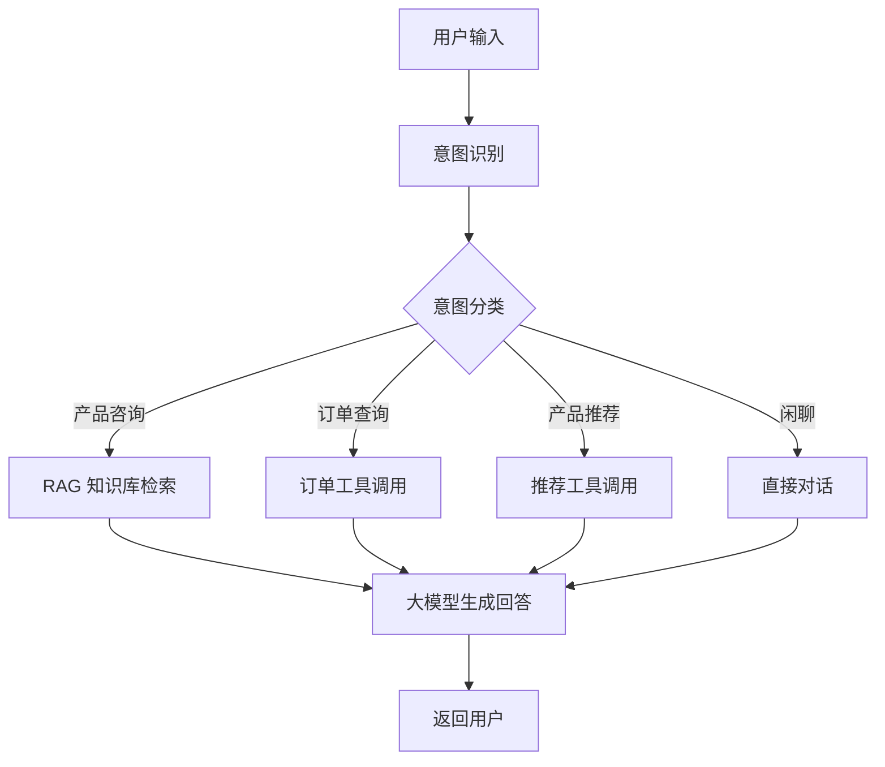

# 熏掌门 AI 智能客服与业务助理系统

## 项目简介

本项目面向武夷山非遗食品品牌「熏掌门」，设计并实现一套基于大语言模型、LangChain、LangGraph 和 RAG 技术的 AI 智能客服与业务助理系统。

系统可以回答产品信息、口味、价格、物流、储存方式等用户问题，并通过知识库检索降低大模型幻觉。同时系统能够识别用户意图，根据不同业务场景调用知识库、订单查询、产品推荐等不同工具。

### 解决的问题

- 熏掌门目前主要通过微信、抖音、小红书等渠道销售非遗熏鹅产品
- 用户咨询过程中，大量问题高度重复（口味选择、储存方式、保质期、加热方式、物流时效等）
- 人工客服重复回答效率低下
- 缺乏统一的客户服务管理系统

### 服务用户

- 熏掌门的潜在客户和老客户
- 通过微信、抖音、小红书等渠道咨询的用户
- 需要了解产品信息、下单、售后服务的用户

### AI 技术

- **大语言模型**：DeepSeek Chat
- **AI 框架**：LangChain + LangGraph
- **RAG 技术**：FAISS/Chroma 向量数据库 + Embedding Model
- **意图识别**：基于 LLM 的用户意图分类
- **工具调用**：Function Calling 实现业务功能

## 项目功能

1. **智能问答**：基于大模型的自然语言问答
2. **用户意图识别**：识别用户咨询、下单、售后等不同意图
3. **企业知识库问答**：基于熏掌门产品知识库的精准回答
4. **RAG 检索增强生成**：通过向量检索降低大模型幻觉
5. **多轮对话记忆**：保持上下文连贯的多轮对话
6. **产品推荐**：根据用户需求智能推荐产品
7. **工具调用**：调用订单查询、库存查询等外部工具
8. **LangGraph 状态流转**：基于状态图的复杂业务流程编排
9. **对话日志记录**：完整的对话历史记录和分析

## 技术栈

| 类别 | 技术 |
|------|------|
| 开发语言 | Python 3.11 |
| 大模型 | DeepSeek Chat |
| AI 框架 | LangChain、LangGraph |
| RAG | FAISS / Chroma、Embedding Model |
| 前端 | Streamlit / Gradio |
| 数据库 | SQLite |
| 版本控制 | Git |
| 开发工具 | VS Code |

## 系统架构



## 项目运行方法

### 1. 拉取代码

```bash
git clone https://github.com/PMA213X/bandcode.git
cd bandcode
```

### 2. 安装依赖

```bash
pip install -r requirements.txt
```

### 3. 配置环境变量

```bash
cp .env.example .env
```

编辑 `.env` 文件：
```
DEEPSEEK_API_KEY=your_api_key
```

### 4. 启动

```bash
# 命令行版本
python main.py

# Web 界面版本
streamlit run app.py
```

## 团队成员

| 成员 | 角色 | GitHub |
|------|------|--------|
| 成员A | 组长/项目经理 | PMA2138 |
| 成员B | AI 开发工程师 A | 3599729594 |
| 成员C | AI 开发工程师 B | wang123456-123456 |
| 成员D | 后端开发工程师 A | tan0310 |
| 成员E | 后端开发工程师 B | lw-womm |
| 成员F | 前端开发工程师 A | hon22079 |
| 成员G | 前端开发工程师 B | malingyun123 |

## 版本历史

| 版本 | 日期 | 说明 |
|------|------|------|
| v0.1.0 | 2026-07-13 | 核心功能完成 |
| v1.0.0 | 2026-07-20 | 正式发布 |

## 许可证

MIT License
