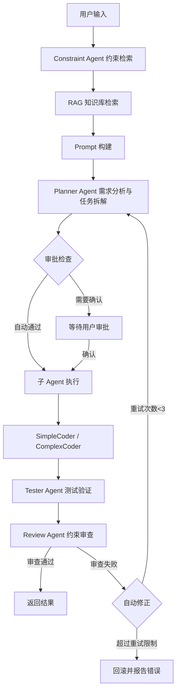

# BandCode — 基于分层记忆与六智能体协作的 AI 编程助手

## 项目简介

本项目设计并实现一套基于大语言模型、多智能体协作和 RAG 技术的 AI 编程助手 CLI 工具——BandCode。

- **解决什么问题？** 开发者在日常编码中面临重复性工作多、项目知识难以沉淀和复用、代码质量依赖个人经验等问题。传统 AI 编程工具缺乏项目级上下文记忆，无法理解项目的架构约定和编码规范，生成的代码往往需要大量人工修改。
- **服务什么用户？** 软件开发工程师、技术团队，尤其是需要在多个项目间切换、希望 AI 能理解项目上下文并生成符合规范代码的开发者。
- **为什么需要这个系统？** 通过六层 Memory 系统实现项目级长期记忆，让 AI 真正"理解"项目；通过六个专业 Agent 协作，实现从需求分析到代码生成、测试验证、约束审查的完整自动化流程；通过 RAG 知识库检索降低大模型幻觉，确保输出符合项目规范。
- **使用了哪些 AI 技术？** MiMo v2.5 Pro 大语言模型（通过 OpenAI 兼容 API 调用）、自研 Pipeline 工作流引擎、六智能体协作架构（Planner/SimpleCoder/ComplexCoder/Tester/Constraint/Review）、ChromaDB 向量数据库 + SentenceTransformers 的 RAG 检索增强生成、六层分层 Memory 系统。

BandCode 能够理解开发者的需求意图，自动检索项目约束和知识库，通过多 Agent 协作完成代码生成、测试验证和审查修正，并将所有决策和知识持久化到分层记忆系统中，实现跨会话的项目知识积累。

## 项目功能

1. **六智能体协作**：Planner 需求分析、SimpleCoder/ComplexCoder 代码生成、Tester 测试验证、Constraint 约束检索、Review 审查修正
2. **六层 Memory 系统**：global / project / task / session / checkpoint / notes，支持项目级长期记忆和跨会话知识积累
3. **RAG 知识库检索**：基于 ChromaDB 向量数据库和 SentenceTransformers 的语义检索，支持知识库文档的自动索引
4. **Pipeline 工作流引擎**：8 节点顺序管线（约束检索→RAG检索→Prompt构建→Planner调度→审批检查→子Agent执行→Tester验证→Review审查）
5. **Review 修正循环**：Review Agent 检测违规后自动反馈给 Planner 重新生成，最多重试 3 次，失败可自动回滚
6. **工具调用系统**：8 个内置工具（read_file、write_file、list_directory、search_project、search_knowledge、create_task、finish_task、update_memory），支持权限控制
7. **SSE 流式输出**：12 种事件类型，全程 Server-Sent Events 实时推送 Agent 执行状态
8. **约束智能检索**：Constraint Agent 从 Memory 中自动筛选与当前任务相关的项目约束
9. **配置驱动**：Agent、Tool、Workflow 均通过 settings.json 配置定义，支持动态调整

## 技术栈

开发语言：Python 3.11（后端）、TypeScript（前端）

大模型：
- MiMo v2.5 Pro（通过 OpenAI 兼容 API 调用）

后端框架：
- FastAPI + Uvicorn
- sse-starlette（SSE 事件推送）

前端框架：
- React 18 + TypeScript
- Tailwind CSS
- Vite

RAG：
- ChromaDB（向量数据库，PersistentClient + HNSW 索引）
- SentenceTransformers all-MiniLM-L6-v2（Embedding 模型，384 维向量）

数据库：
- SQLite（会话、消息、任务、快照）

其他：
- Git
- VS Code
- pytest（测试框架）

## 系统架构



## 项目运行方法

### 1. 拉取代码

```bash
git clone https://github.com/PMA213X/bandcode.git
cd bandcode
```

### 2. 安装依赖

```bash
# 后端依赖
cd backend
pip install -r requirements.txt

# 前端依赖
cd ../frontend-web
npm install
```

### 3. 配置环境变量

```bash
cp settings.example.json settings.json
```

编辑 `settings.json` 文件：
```json
{
  "模型设置": {
    "默认模型": "xiaomi/mimo-v2.5-pro",
    "Base URL": "https://api.example.com/v1",
    "API Key": "your-api-key-here"
  }
}
```

### 4. 启动

```bash
# 启动后端
cd backend
python main.py

# 启动前端（新终端）
cd frontend-web
npm run dev
```

## 团队成员

| 成员 | 角色 | GitHub |
|------|------|--------|
| 成员A | 组长/项目经理 | PMA2138 |
| 成员B | AI 开发工程师 A（RAG 方向）| 3599729594 |
| 成员C | AI 开发工程师 B（Agent 方向）| wang123456-123456 |
| 成员D | 后端开发工程师 A | tan0310 |
| 成员E | 后端开发工程师 B | lw-womm |
| 成员F | 前端开发工程师 A | hon22079 |
| 成员G | 前端开发工程师 B | malingyun123 |
