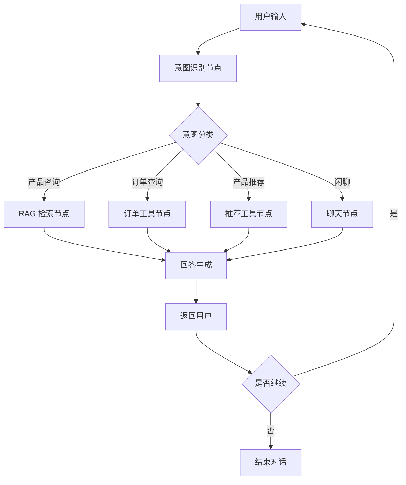

# 第二章 产品设计

## 2.1 产品功能架构

```
熏掌门 AI 智能客服系统
├── 智能问答模块
│   ├── 意图识别
│   ├── 知识库检索
│   └── 回答生成
├── 工具调用模块
│   ├── 订单查询
│   ├── 库存查询
│   └── 产品推荐
├── 对话管理模块
│   ├── 多轮对话
│   ├── 上下文记忆
│   └── 对话日志
└── 用户界面模块
    ├── Web 聊天界面
    └── 管理后台
```

## 2.2 功能清单

| 编号 | 功能 | 优先级 | 说明 |
|------|------|--------|------|
| F01 | 智能问答 | P0 | 基于大模型的自然语言问答 |
| F02 | 意图识别 | P0 | 识别用户咨询、下单、售后等意图 |
| F03 | 知识库问答 | P0 | 基于 RAG 的精准回答 |
| F04 | 多轮对话 | P0 | 保持上下文连贯 |
| F05 | 产品推荐 | P1 | 智能推荐产品 |
| F06 | 工具调用 | P1 | 调用外部工具 |
| F07 | 对话日志 | P1 | 记录对话历史 |
| F08 | 管理后台 | P2 | 知识库管理、数据分析 |

## 2.3 核心业务流程


