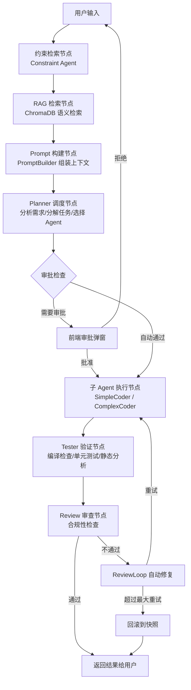

# 第二章 产品设计

## 2.1 产品功能架构

```
BandCode
├── 对话系统
│   ├── 流式聊天（SSE 实时推送）
│   ├── 聊天历史管理
│   ├── 斜杠命令（Command Palette）
│   └── @文件引用（File Selector）
├── Agent 系统
│   ├── Planner（需求分析与任务调度）
│   ├── SimpleCoder（简单编码任务）
│   ├── ComplexCoder（复杂编码任务）
│   ├── Tester（测试验证）
│   ├── Constraint（约束检索）
│   └── Review（审查修正）
├── 记忆系统
│   ├── Global Memory（全局记忆）
│   ├── Project Memory（项目记忆）
│   ├── Task Memory（任务记忆）
│   ├── Session Memory（会话记忆）
│   ├── Checkpoint Memory（快照记忆）
│   └── Notes（笔记）
├── 知识库系统
│   ├── 文档加载与切分
│   ├── 向量化索引
│   ├── 语义检索
│   └── 知识库管理
├── 工具系统
│   ├── 文件操作（read_file、write_file、list_directory）
│   ├── 搜索工具（search_project、search_knowledge）
│   ├── 任务管理（create_task、finish_task）
│   └── 记忆管理（update_memory）
├── 配置系统
│   ├── 模型配置
│   ├── Agent 配置
│   ├── 工作流配置
│   └── RAG 配置
└── Web 界面
    ├── 聊天界面
    ├── 设置界面
    ├── 记忆浏览
    ├── 文件浏览器
    └── 模型测试
```

## 2.2 功能清单

| 功能模块 | 功能名称 | 功能描述 | 优先级 |
|----------|----------|----------|--------|
| 对话系统 | 流式聊天 | 基于 SSE 的实时流式对话，支持 12 种事件类型 | P0 |
| 对话系统 | 聊天历史 | 按会话管理聊天记录，支持查看、删除 | P0 |
| 对话系统 | 斜杠命令 | `/` 触发命令面板，快速执行常用操作 | P1 |
| 对话系统 | @文件引用 | `@` 触发文件选择器，将文件内容注入上下文 | P1 |
| Agent 系统 | 智能调度 | Planner 根据任务复杂度自动选择 SimpleCoder 或 ComplexCoder | P0 |
| Agent 系统 | 自动升级 | SimpleCoder 检测到任务复杂时自动升级到 ComplexCoder | P0 |
| Agent 系统 | 约束检索 | Constraint Agent 从 Memory 中检索相关约束信息 | P1 |
| Agent 系统 | 测试验证 | Tester Agent 自动执行编译检查、单元测试、静态分析 | P0 |
| Agent 系统 | 合规审查 | Review Agent 检查代码是否符合项目规范和约束 | P0 |
| Agent 系统 | 审查循环 | Review 不通过时自动修复并重试，支持快照回滚 | P1 |
| 记忆系统 | 六层记忆 | global / project / task / session / checkpoint / notes 分层存储 | P0 |
| 记忆系统 | 记忆检索 | 跨层搜索记忆内容，支持关键词匹配 | P1 |
| 记忆系统 | 自动记录 | AutoRecorder 自动记录对话、工具调用、代码变更、决策、错误 | P0 |
| 记忆系统 | 会话压缩 | SessionCompressor 自动压缩过长会话，清理过期会话 | P2 |
| 知识库 | 文档切分 | DocumentChunker 支持按段落/按句子切分，超长文本自动分割 | P0 |
| 知识库 | 向量化 | SentenceTransformers all-MiniLM-L6-v2 模型，384 维向量 | P0 |
| 知识库 | 语义检索 | ChromaDB 余弦相似度检索，支持 Top-K 和元数据过滤 | P0 |
| 知识库 | 知识库管理 | 支持文件级、目录级索引，增量更新 | P1 |
| 工具系统 | 文件操作 | 读取、写入、列出目录内容 | P0 |
| 工具系统 | 搜索工具 | 项目文件搜索、知识库搜索 | P0 |
| 工具系统 | 任务管理 | 创建任务、完成任务 | P1 |
| 工具系统 | 权限控制 | 四级权限（read/write/bash/admin），Agent 声明式权限配置 | P0 |
| 配置系统 | 模型配置 | 配置 LLM 模型、API Key、温度等参数 | P0 |
| 配置系统 | Agent 配置 | 配置各 Agent 的模型、温度、权限等 | P1 |
| Web 界面 | 聊天界面 | 消息气泡、Agent 状态指示、流式输出 | P0 |
| Web 界面 | 设置界面 | 6 个配置分区的可视化编辑 | P1 |
| Web 界面 | 记忆浏览 | 六层 Memory 的可视化浏览和搜索 | P1 |
| Web 界面 | 文件浏览器 | 项目目录树展示，文件内容查看 | P2 |
| Web 界面 | 模型测试 | 测试 LLM 连接和流式输出 | P2 |

## 2.3 核心业务流程



### 流程说明

1. **约束检索**：Constraint Agent 从六层 Memory 中检索与当前任务相关的约束信息（编码规范、架构决策、历史教训等），为后续 Agent 提供参考。
2. **RAG 检索**：将用户输入向量化后，在 ChromaDB 中执行余弦相似度检索，获取 Top-K 相关文档片段作为知识上下文。
3. **Prompt 构建**：PromptBuilder 将系统提示词、记忆上下文、RAG 上下文、用户消息等组装为完整的 Prompt。
4. **Planner 调度**：Planner Agent 分析用户需求，分解为子任务，并根据任务复杂度选择 SimpleCoder（简单任务）或 ComplexCoder（复杂任务）执行。
5. **审批检查**：对于高风险操作（如删除文件、修改配置），弹出审批对话框等待用户确认。
6. **子 Agent 执行**：被选中的 Coder Agent 使用工具系统（read_file、write_file 等）完成编码任务。
7. **Tester 验证**：Tester Agent 执行编译检查、单元测试、静态分析，验证代码质量。
8. **Review 审查**：Review Agent 检查代码是否符合项目规范和约束。不通过时触发 ReviewLoop 自动修复，超过最大重试次数则回滚到快照。
