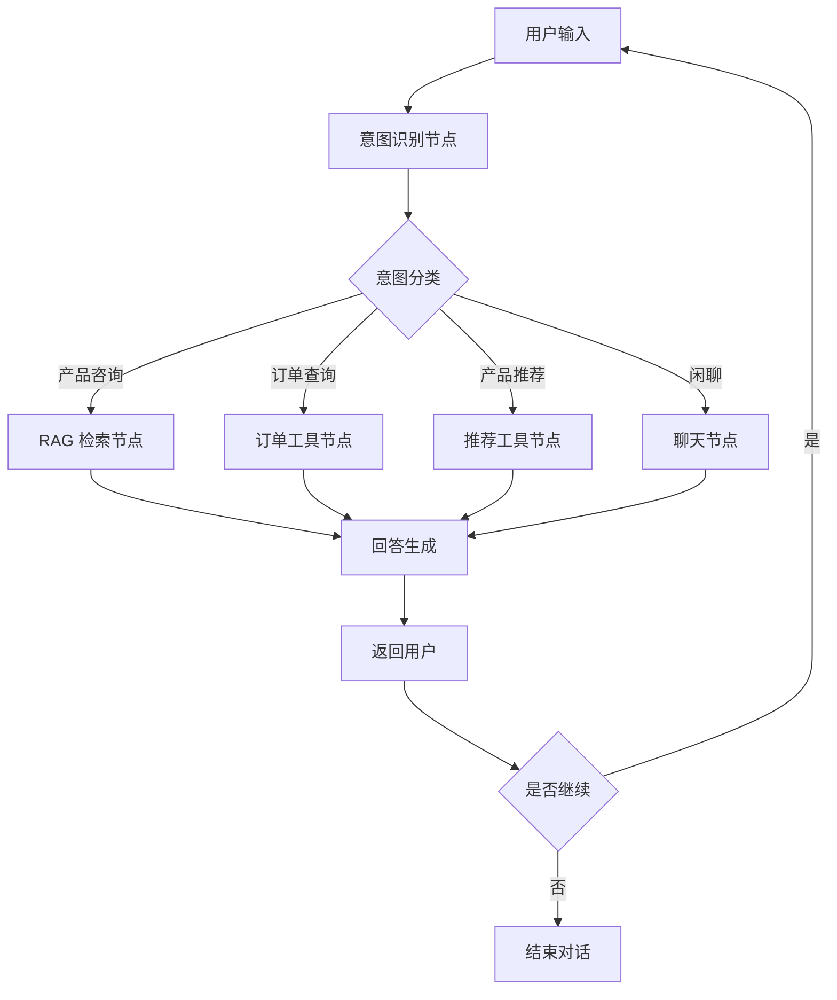

# 第二章 产品设计

## 2.1 产品功能架构

```
熏掌门 AI 智能客服系统
├── 智能问答模块
│   ├── 意图识别
│   ├── 知识库检索
│   └── 回答生成
├── 工具调用模块
│   ├── 订单查询
│   ├── 库存查询
│   └── 产品推荐
├── 对话管理模块
│   ├── 多轮对话
│   ├── 上下文记忆
│   └── 对话日志
└── 用户界面模块
    ├── Web 聊天界面
    └── 管理后台
```

## 2.2 功能清单

| 编号 | 功能 | 优先级 | 说明 |
|------|------|--------|------|
| F01 | 智能问答 | P0 | 基于大模型的自然语言问答 |
| F02 | 意图识别 | P0 | 识别用户咨询、下单、售后等意图 |
| F03 | 知识库问答 | P0 | 基于 RAG 的精准回答 |
| F04 | 多轮对话 | P0 | 保持上下文连贯 |
| F05 | 产品推荐 | P1 | 智能推荐产品 |
| F06 | 工具调用 | P1 | 调用外部工具 |
| F07 | 对话日志 | P1 | 记录对话历史 |
| F08 | 管理后台 | P2 | 知识库管理、数据分析 |

## 2.3 核心业务流程



## 2.4 用户交互流程

### 聊天主流程

1. 用户在 Web 聊天界面输入问题
2. 前端通过 GET 请求调用 `/api/chat/stream` 接口，传递 session_id、project、message
3. 后端创建 asyncio.Queue 事件队列，启动后台任务处理 Agent 工作流
4. 返回 SSE 响应（EventSourceResponse），前端实时接收 12 种事件类型
5. 前端根据事件类型更新界面：agent_start 显示当前 Agent 状态、text 实时追加回复文本、done 标记完成

### 事件类型说明

| 事件类型 | 触发时机 | 前端处理 |
|----------|----------|----------|
| agent_start | Agent 开始执行 | 显示当前 Agent 名称和运行状态 |
| constraint_result | 约束检索完成 | 展示检索到的约束列表 |
| plan | Planner 输出计划 | 显示任务列表和委派 Agent |
| approval_required | 需要用户审批 | 弹出确认对话框 |
| tool_call | 工具调用 | 显示工具名称和参数 |
| code | 代码生成 | 展示生成的代码文件 |
| test_result | 测试完成 | 显示测试通过/失败状态 |
| review_result | 审查完成 | 显示审查结果和违规项 |
| memory_update | Memory 更新 | 提示记忆已更新 |
| text | LLM 流式文本 | 实时追加到消息列表（打字机效果） |
| done | 任务完成 | 标记任务结束 |
| chat_error | 发生错误 | 显示错误信息 |

## 2.5 界面模块设计

### 聊天界面（Chat.tsx）

聊天界面是用户交互的核心，包含消息列表、输入框和状态显示区域。消息列表支持用户消息和 AI 回复两种样式，AI 回复支持 Markdown 渲染。输入框支持 Enter 发送，Shift+Enter 换行。界面底部显示当前 Agent 执行状态。

### 侧边栏（Sidebar.tsx）

侧边栏提供导航功能，支持快捷键操作。包含新建对话、历史记录、记忆视图、设置面板等入口。

### 命令面板（CommandPalette.tsx）

命令面板提供快捷命令搜索与执行功能，用户可以通过快捷键呼出，快速执行常用操作。

### 设置面板（Settings.tsx）

设置面板展示和编辑系统配置，包括模型设置（Base URL、API Key、默认模型、各 Agent 模型）、工作流配置（约束检索开关、自动修正开关、最大修正次数等）。
