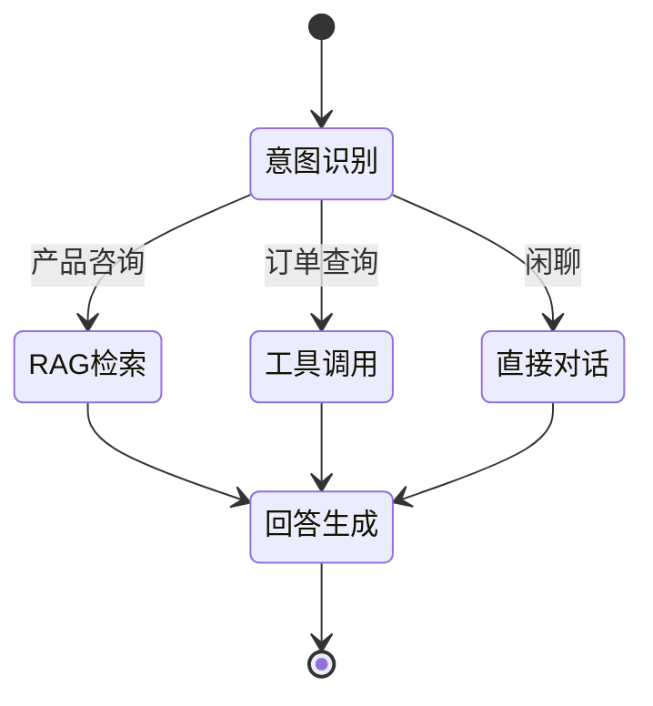

# 第三章 技术架构设计

## 3.1 总体技术架构

```
┌─────────────────────────────────────────────────────────┐
│                    用户界面层                            │
│              Streamlit / Gradio Web UI                   │
└─────────────────────────┬───────────────────────────────┘
                          │
┌─────────────────────────┼───────────────────────────────┐
│                    应用服务层                            │
│  ┌──────────┐  ┌──────────┐  ┌──────────┐              │
│  │ 意图识别  │  │ 对话管理  │  │ 工具调用  │              │
│  └──────────┘  └──────────┘  └──────────┘              │
└─────────────────────────┼───────────────────────────────┘
                          │
┌─────────────────────────┼───────────────────────────────┐
│                    AI 核心层                             │
│  ┌──────────┐  ┌──────────┐  ┌──────────┐              │
│  │LangChain │  │LangGraph │  │ RAG 引擎  │              │
│  └──────────┘  └──────────┘  └──────────┘              │
└─────────────────────────┼───────────────────────────────┘
                          │
┌─────────────────────────┼───────────────────────────────┐
│                    数据存储层                            │
│  ┌──────────┐  ┌──────────┐  ┌──────────┐              │
│  │  SQLite  │  │  FAISS   │  │ 日志文件  │              │
│  └──────────┘  └──────────┘  └──────────┘              │
└─────────────────────────────────────────────────────────┘
```

## 3.2 技术选型

| 类别 | 技术 | 选型理由 |
|------|------|----------|
| 大模型 | DeepSeek Chat | 性价比高，中文支持好 |
| AI 框架 | LangChain | 成熟的 LLM 应用框架 |
| 状态管理 | LangGraph | 支持复杂的状态流转 |
| 向量数据库 | FAISS | 轻量级，易于部署 |
| 前端 | Streamlit | 快速开发 Web 界面 |
| 数据库 | SQLite | 轻量级，无需额外服务 |

## 3.3 LangChain 使用说明

本项目使用了以下 LangChain 组件：

| 组件 | 用途 |
|------|------|
| ChatOpenAI | 调用 DeepSeek API |
| PromptTemplate | 构建提示词模板 |
| RetrievalQA | RAG 问答链 |
| AgentExecutor | 工具调用执行器 |
| ConversationBufferMemory | 对话历史记忆 |

## 3.4 LangGraph 状态图设计



### AgentState 定义

```python
from typing import TypedDict, List, Annotated
from langgraph.graph import add_messages

class AgentState(TypedDict):
    messages: Annotated[list, add_messages]
    intent: str
    context: List[str]
    tool_result: str
```
