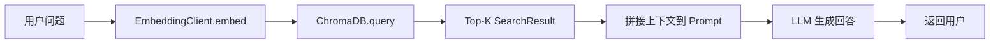

# 第四章 RAG 知识库设计

## 4.1 数据来源

| 数据类型 | 来源 | 内容 |
|----------|------|------|
| 产品信息 | 官方文档 | 产品名称、口味、规格、价格 |
| 常见问题 | 客服记录 | 用户高频问题及标准回答 |
| 物流政策 | 运营文档 | 配送方式、时效、费用 |
| 售后政策 | 公司制度 | 退换货规则、投诉处理 |

## 4.2 文本切分器（DocumentChunker）

`backend/rag/chunker.py` 实现了自定义的文档切分器，支持两种切分模式：

### TextChunk 数据结构

```python
@dataclass
class TextChunk:
    content: str       # 文本块内容
    index: int         # 块索引
    metadata: dict     # 元数据（paragraph、sub_index、sentence_start 等）
```

### 按段落切分（chunk_by_paragraph）

以 `\n\n`（双换行符）为分隔符切分文档。每个段落作为一个 TextChunk，保留段落索引作为元数据。当段落长度超过 `max_chunk_size`（默认 1000 字符）时，调用 `_split_long_text` 方法进一步切分：

```python
def chunk_by_paragraph(self, text: str) -> list[TextChunk]:
    paragraphs = [p.strip() for p in text.split("\n\n") if p.strip()]
    chunks = []
    for i, para in enumerate(paragraphs):
        if len(para) > self.max_chunk_size:
            sub_chunks = self._split_long_text(para)  # 超长文本二次切分
            for j, sub in enumerate(sub_chunks):
                chunks.append(TextChunk(content=sub, index=len(chunks),
                    metadata={"paragraph": i, "sub_index": j}))
        else:
            chunks.append(TextChunk(content=para, index=i,
                metadata={"paragraph": i}))
    return chunks
```

### 按句子切分（chunk_by_sentence）

使用正则表达式 `(?<=[。！？.!?])\s*` 按中英文句号、感叹号、问号切分。支持 overlap 机制，在切分边界处保留上下文：

```python
def chunk_by_sentence(self, text: str) -> list[TextChunk]:
    sentences = re.split(r'(?<=[。！？.!?])\s*', text)
    # 将多个句子合并到一个 chunk，直到达到 max_chunk_size
    # 超出时保留 overlap 词语确保语义连贯
```

### 超长文本切分（_split_long_text）

当单个段落超过 max_chunk_size 时，按固定长度切分，优先在句号处断开，保留 overlap 避免语义断裂：

```python
def _split_long_text(self, text: str) -> list[str]:
    # 尝试在句号处断开，保留 self.overlap 的重叠区域
    last_period = text.rfind("。", start, end)
    if last_period > start:
        end = last_period + 1
    start = end - self.overlap
```

## 4.3 Embedding 模型

`backend/models/embedding.py` 封装了 SentenceTransformers 的向量化功能：

```python
class EmbeddingClient:
    MODEL_DIMENSIONS = {
        "all-MiniLM-L6-v2": 384,
        "all-mpnet-base-v2": 768,
        "paraphrase-multilingual-MiniLM-L12-v2": 384,
    }

    def __init__(self, model_name: str = "all-MiniLM-L6-v2"):
        self.model = SentenceTransformer(model_name)
        self.dimension = self.MODEL_DIMENSIONS.get(model_name, 384)

    def embed(self, text: str) -> list[float]:
        """单条文本向量化"""
        embedding = self.model.encode(text, convert_to_numpy=True)
        return embedding.tolist()

    def embed_batch(self, texts: list[str]) -> list[list[float]]:
        """批量文本向量化"""
        embeddings = self.model.encode(texts, convert_to_numpy=True)
        return embeddings.tolist()
```

默认使用 `all-MiniLM-L6-v2` 模型，输出 384 维向量。支持多种模型切换，不同模型的向量维度会自动适配。

## 4.4 向量数据库（ChromaDB）

`backend/rag/indexer.py` 和 `backend/rag/retriever.py` 使用 ChromaDB 作为向量数据库：

### RAGIndexer 索引器

```python
class RAGIndexer:
    def __init__(self, chroma_path="./chroma", collection_name="knowledge"):
        self.client = chromadb.PersistentClient(path=chroma_path)
        self.collection = self.client.get_or_create_collection(
            name=collection_name,
            metadata={"hnsw:space": "cosine"}  # 使用余弦距离
        )
```

索引器提供三个层级的索引接口：

| 方法 | 功能 | 使用场景 |
|------|------|----------|
| index_documents(documents, metadatas) | 索引多条文档 | 批量导入产品信息、FAQ |
| index_file(file_path) | 索引单个文件 | 更新单个知识库文件 |
| index_directory(dir_path, pattern) | 索引目录下所有匹配文件 | 全量重建知识库 |

索引流程：文档 → DocumentChunker 切分 → EmbeddingClient 批量向量化 → ChromaDB collection.add()

### RAGRetriever 检索器

```python
class RAGRetriever:
    def search(self, query: str, top_k: int = 5) -> list[SearchResult]:
        """相似度检索"""
        query_embedding = self.embedding_client.embed(query)
        results = self.collection.query(
            query_embeddings=[query_embedding],
            n_results=min(top_k, self.collection.count())
        )
        # 将距离转换为相似度分数: score = 1 - distance

    def search_with_filter(self, query, top_k=5, where=None) -> list[SearchResult]:
        """带过滤条件的检索（支持元数据过滤）"""
```

### SearchResult 数据结构

```python
@dataclass
class SearchResult:
    content: str      # 检索到的文本内容
    score: float      # 相似度分数（0-1，越大越相关）
    metadata: dict    # 元数据（source、filename 等）
```

## 4.5 检索流程



完整检索流程：

1. 用户输入问题文本
2. EmbeddingClient.embed() 将问题向量化（384 维）
3. ChromaDB collection.query() 执行余弦相似度检索
4. 返回 Top-K 个 SearchResult（包含 content、score、metadata）
5. 将检索结果的 content 拼接到 LLM Prompt 中作为上下文
6. LLM 基于上下文生成回答，减少幻觉
