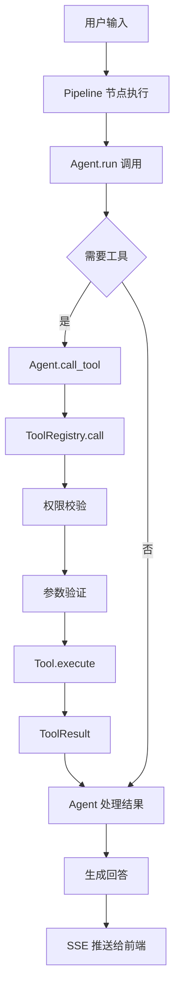

# 第五章 Agent 与工具调用设计

## 5.1 Agent 架构设计

### BaseAgent 基类

`backend/agents/base.py` 定义了所有 Agent 的抽象基类：

```python
class BaseAgent(ABC):
    name: str = "base"           # Agent 名称
    description: str = ""        # Agent 描述
    model: str = "mimo-v2.5-pro" # 使用的 LLM 模型
    temperature: float = 0.1     # 生成温度
    system_prompt: str = ""      # 系统提示词
    permissions: dict = {        # 工具权限配置
        "read": "allow",
        "edit": "allow",
        "bash": "allow"
    }

    @abstractmethod
    async def run(self, state: PipelineState) -> PipelineState:
        """执行 Agent 逻辑（子类必须实现）"""

    async def call_llm(self, messages, temperature=None) -> str:
        """调用 LLM"""

    async def call_tool(self, tool_name: str, args: dict) -> Any:
        """调用 Tool（通过 ToolRegistry）"""

    def report_status(self, status: str, data: dict = None):
        """上报状态（SSE 推送）"""

    def add_to_history(self, state, action, result):
        """添加到 Agent 执行历史"""
```

BaseAgent 提供了统一的接口：LLM 调用（call_llm）、工具调用（call_tool）、状态上报（report_status）、历史记录（add_to_history）。所有业务 Agent 和系统 Agent 都继承此类。

### Agent 管理器（AgentManager）

`backend/agents/manager.py` 实现了 Agent 的自动发现和生命周期管理：

```python
class AgentManager:
    def __init__(self, llm_client: LLMClient):
        self.agents: dict[str, BaseAgent] = {}

    def auto_discover(self, agents_dir=None):
        """自动扫描 agents/ 目录，发现并注册所有 Agent"""
        for file_path in Path(agents_dir).glob("*.py"):
            if file_path.name.startswith("_") or file_path.name in ["base.py", "manager.py"]:
                continue
            module = importlib.import_module(f"agents.{file_path.stem}")
            for attr_name in dir(module):
                attr = getattr(module, attr_name)
                if isinstance(attr, type) and issubclass(attr, BaseAgent) and attr is not BaseAgent:
                    agent = attr(self.llm_client)
                    self.register(agent)

    async def run(self, name: str, state: PipelineState) -> PipelineState:
        """执行指定 Agent（带权限检查）"""
        agent = self.get(name)
        if not self._check_permissions(agent):
            raise PermissionError(...)
        state.current_agent = name
        return await agent.run(state)
```

AgentManager 通过 `importlib` 动态导入模块，自动扫描 `agents/` 目录下的 Python 文件，查找 BaseAgent 的子类并实例化注册。新增 Agent 只需在 agents/ 目录下创建新的 Python 文件，无需修改框架代码。

## 5.2 Tool 架构设计

### Tool 基类

`backend/tools/base.py` 定义了工具的抽象基类：

```python
class Tool(ABC):
    name: str = "base"           # 工具名称
    description: str = ""        # 工具描述
    permission: str = "read"     # 所需权限: read/write/bash/admin
    parameters: dict = {}        # 参数定义（JSON Schema 格式）

    @abstractmethod
    async def execute(self, **kwargs) -> ToolResult:
        """执行工具（子类必须实现）"""

    def validate_params(self, **kwargs) -> bool:
        """验证参数（检查必需参数）"""

    def get_schema(self) -> dict:
        """获取工具 JSON Schema"""
```

### ToolResult 数据结构

```python
@dataclass
class ToolResult:
    success: bool              # 执行是否成功
    data: Any = None           # 返回数据（成功时）
    error: Optional[str] = None # 错误信息（失败时）
    execution_time: Optional[float] = None  # 执行时间（秒）
```

### Tool 注册中心（ToolRegistry）

`backend/tools/registry.py` 实现了工具的自动发现和权限校验：

```python
class ToolRegistry:
    def __init__(self):
        self.tools: dict[str, Tool] = {}

    def auto_discover(self, tools_dir=None):
        """自动扫描 tools/ 和 tools/builtins/ 目录"""
        # 扫描 tools/*.py
        for file_path in Path(tools_dir).glob("*.py"):
            # 动态导入并注册 Tool 子类
        # 扫描 tools/builtins/*.py
        self._discover_builtins(builtins_dir)

    async def call(self, name, args, agent_permissions) -> ToolResult:
        """调用工具（权限校验 → 参数验证 → 执行）"""
        tool = self.get(name)
        if not self._check_permission(tool, agent_permissions):
            return ToolResult(success=False, error="Permission denied")
        if not tool.validate_params(**args):
            return ToolResult(success=False, error="Invalid parameters")
        return await tool.execute(**args)
```

### 权限控制模型

工具权限分为四级：read（只读）、write（写入）、bash（命令执行）、admin（管理权限）。每个 Agent 通过 `permissions` 字典声明自己拥有的权限，ToolRegistry 在执行工具前检查 Agent 是否拥有所需权限：

```
Agent.permissions = {"read": "allow", "edit": "allow", "bash": "allow"}
Tool.permission = "write"
→ ToolRegistry._check_permission() 检查 agent_permissions["write"] == "allow"
```

## 5.3 内置工具

项目在 `backend/tools/builtins/` 目录下实现了 8 个内置工具：

| 工具名称 | 功能 | 权限 |
|----------|------|------|
| read_file | 读取文件内容 | read |
| write_file | 写入文件内容 | write |
| list_directory | 列出目录内容 | read |
| search_project | 搜索项目文件 | read |
| search_knowledge | 搜索知识库 | read |
| create_task | 创建任务 | write |
| finish_task | 完成任务 | write |
| update_memory | 更新记忆 | write |

## 5.4 工具调用流程



### 完整调用链

1. Pipeline 执行到子 Agent 节点时，调用 AgentManager.run(agent_name, state)
2. AgentManager 检查 Agent 权限后调用 agent.run(state)
3. Agent 内部通过 call_llm 分析需求，判断是否需要调用工具
4. 如需工具，Agent 调用 self.call_tool(tool_name, args)
5. call_tool 通过 self._tool_registry.call() 执行工具
6. ToolRegistry 先检查权限（_check_permission），再验证参数（validate_params），最后执行 tool.execute()
7. 返回 ToolResult（success/data/error/execution_time）
8. Agent 将工具结果整合到 state 中，继续后续流程

## 5.5 Agent 提示词管理

每个 Agent 的提示词存储在 `agents/*.md` 文件中（planner.md、constraint.md、review.md、simple-coder.md、complex-coder.md、tester.md），通过 Agent 子类的 `system_prompt` 属性加载。提示词定义了 Agent 的角色、职责、输出格式等，是 Agent 行为的核心驱动力。

## 5.6 扩展性设计

### 新增 Agent

1. 在 `agents/` 目录下创建新的 Python 文件
2. 继承 BaseAgent，实现 run 方法
3. 定义 name、description、system_prompt 等属性
4. AgentManager.auto_discover 会自动发现并注册

### 新增工具

1. 在 `tools/builtins/` 目录下创建新的 Python 文件
2. 继承 Tool，实现 execute 方法
3. 定义 name、description、permission、parameters
4. ToolRegistry.auto_discover 会自动发现并注册

整个扩展过程无需修改框架代码，体现了良好的开闭原则。
