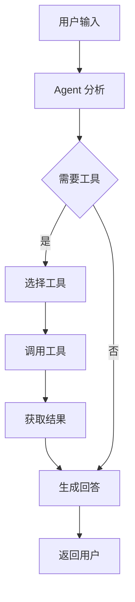

# 第五章 Agent 与工具调用设计

## 5.1 Tool 设计

| 工具名称 | 功能 | 输入 | 输出 |
|----------|------|------|------|
| query_order | 查询订单状态 | 订单号 | 订单详情 |
| search_product | 搜索产品 | 关键词 | 产品列表 |
| recommend_product | 推荐产品 | 用户需求 | 推荐结果 |
| check_inventory | 查询库存 | 产品ID | 库存数量 |

## 5.2 工具调用流程



### 工具定义示例

```python
from langchain.tools import tool

@tool
def query_order(order_id: str) -> str:
    """查询订单状态"""
    # 查询数据库
    order = db.get_order(order_id)
    if order:
        return f"订单 {order_id} 状态：{order.status}，预计 {order.eta} 送达"
    return f"未找到订单 {order_id}"
```
