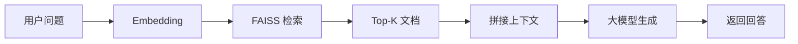
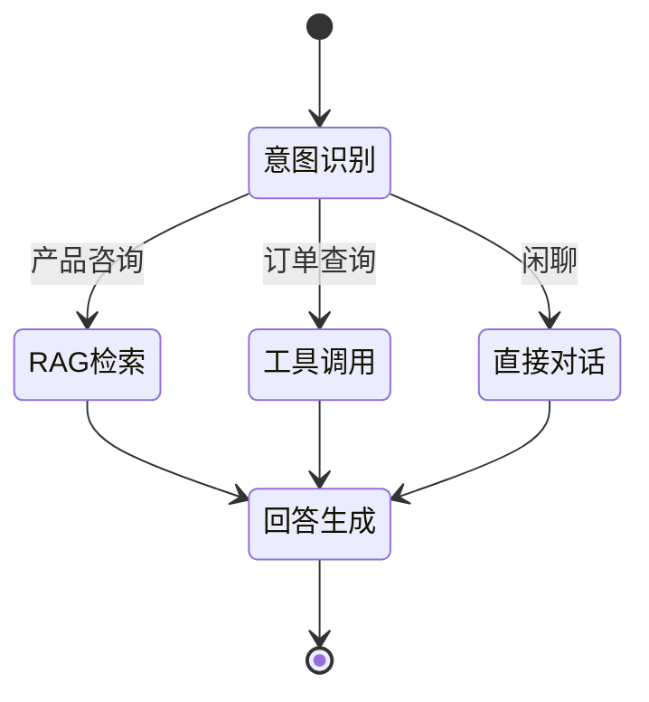

# 熏掌门 AI 智能客服与业务助理系统 — 设计与实现报告

## 一、项目概述

### 1.1 项目背景

熏掌门是武夷山非遗食品品牌，主要销售非遗熏鹅产品。目前主要通过微信、抖音、小红书等渠道进行销售。在用户咨询过程中，大量问题高度重复（口味选择、储存方式、保质期、加热方式、物流时效等），人工客服重复回答效率低下，且无法保证回答的一致性。

### 1.2 项目目标

1. 实现 7x24 小时智能客服，自动回答用户常见问题
2. 通过 RAG 技术降低大模型幻觉，确保回答准确性
3. 识别用户意图，自动调用相关工具完成业务操作
4. 记录对话日志，支持数据分析和优化
5. 提供友好的用户交互界面

## 二、需求分析

### 2.1 用户痛点

| 痛点 | 描述 | 影响 |
|------|------|------|
| 重复问答 | 大量相似问题需要人工重复回答 | 客服效率低，人力成本高 |
| 响应慢 | 人工客服无法24小时在线 | 用户体验差，潜在客户流失 |
| 回答不一致 | 不同客服回答可能存在差异 | 品牌形象受损 |
| 缺乏数据 | 无法统计分析用户咨询内容 | 无法优化产品和服务 |

### 2.2 核心使用场景

| 场景 | 描述 | 示例 |
|------|------|------|
| 产品咨询 | 用户询问产品信息 | 「你们的熏鹅有哪些口味？」 |
| 价格查询 | 用户询问价格 | 「熏鹅多少钱一只？」 |
| 物流咨询 | 用户询问配送方式 | 「可以发顺丰吗？多久能到？」 |
| 储存方式 | 用户询问保存方法 | 「熏鹅怎么保存？能放多久？」 |
| 订单查询 | 用户查询订单状态 | 「我的订单到哪了？」 |
| 产品推荐 | 用户需要推荐 | 「送礼选哪个比较好？」 |
| 售后服务 | 用户反馈问题 | 「我收到的熏鹅有问题」 |

## 三、产品设计

### 3.1 功能架构

```
熏掌门 AI 智能客服系统
├── 智能问答模块
│   ├── 意图识别
│   ├── 知识库检索
│   └── 回答生成
├── 工具调用模块
│   ├── 订单查询
│   ├── 库存查询
│   └── 产品推荐
├── 对话管理模块
│   ├── 多轮对话
│   ├── 上下文记忆
│   └── 对话日志
└── 用户界面模块
    ├── Web 聊天界面
    └── 管理后台
```

### 3.2 功能清单

| 编号 | 功能 | 优先级 | 说明 |
|------|------|--------|------|
| F01 | 智能问答 | P0 | 基于大模型的自然语言问答 |
| F02 | 意图识别 | P0 | 识别用户咨询、下单、售后等意图 |
| F03 | 知识库问答 | P0 | 基于 RAG 的精准回答 |
| F04 | 多轮对话 | P0 | 保持上下文连贯 |
| F05 | 产品推荐 | P1 | 智能推荐产品 |
| F06 | 工具调用 | P1 | 调用外部工具 |
| F07 | 对话日志 | P1 | 记录对话历史 |
| F08 | 管理后台 | P2 | 知识库管理、数据分析 |

## 四、技术架构设计

### 4.1 总体架构

系统采用分层架构设计，共分为四层：

```
┌─────────────────────────────────────────────────────────┐
│                    用户界面层                            │
│              Streamlit / Gradio Web UI                   │
└─────────────────────────┬───────────────────────────────┘
                          │
┌─────────────────────────┼───────────────────────────────┐
│                    应用服务层                            │
│  ┌──────────┐  ┌──────────┐  ┌──────────┐              │
│  │ 意图识别  │  │ 对话管理  │  │ 工具调用  │              │
│  └──────────┘  └──────────┘  └──────────┘              │
└─────────────────────────┼───────────────────────────────┘
                          │
┌─────────────────────────┼───────────────────────────────┐
│                    AI 核心层                             │
│  ┌──────────┐  ┌──────────┐  ┌──────────┐              │
│  │LangChain │  │LangGraph │  │ RAG 引擎  │              │
│  └──────────┘  └──────────┘  └──────────┘              │
└─────────────────────────┼───────────────────────────────┘
                          │
┌─────────────────────────┼───────────────────────────────┐
│                    数据存储层                            │
│  ┌──────────┐  ┌──────────┐  ┌──────────┐              │
│  │  SQLite  │  │  FAISS   │  │ 日志文件  │              │
│  └──────────┘  └──────────┘  └──────────┘              │
└─────────────────────────────────────────────────────────┘
```

### 4.2 技术选型

| 类别 | 技术 | 选型理由 |
|------|------|----------|
| 大模型 | DeepSeek Chat | 性价比高，中文支持好 |
| AI 框架 | LangChain | 成熟的 LLM 应用框架 |
| 状态管理 | LangGraph | 支持复杂的状态流转 |
| 向量数据库 | FAISS | 轻量级，易于部署 |
| 前端 | Streamlit | 快速开发 Web 界面 |
| 数据库 | SQLite | 轻量级，无需额外服务 |

## 五、RAG 知识库设计

### 5.1 数据来源

| 数据类型 | 来源 | 内容 |
|----------|------|------|
| 产品信息 | 官方文档 | 产品名称、口味、规格、价格 |
| 常见问题 | 客服记录 | 用户高频问题及标准回答 |
| 物流政策 | 运营文档 | 配送方式、时效、费用 |
| 售后政策 | 公司制度 | 退换货规则、投诉处理 |

### 5.2 检索流程



### 5.3 关键实现

- **文本切分**：使用 RecursiveCharacterTextSplitter，chunk_size=500，overlap=50
- **Embedding**：使用 shibing624/text2vec-base-chinese 中文向量模型
- **向量数据库**：FAISS，支持本地存储和快速检索
- **检索策略**：Top-K 相似度检索，K=3

## 六、Agent 与工具调用设计

### 6.1 LangGraph 状态图



### 6.2 AgentState 定义

```python
from typing import TypedDict, List, Annotated
from langgraph.graph import add_messages

class AgentState(TypedDict):
    messages: Annotated[list, add_messages]
    intent: str
    context: List[str]
    tool_result: str
```

### 6.3 工具设计

| 工具名称 | 功能 | 输入 | 输出 |
|----------|------|------|------|
| query_order | 查询订单状态 | 订单号 | 订单详情 |
| search_product | 搜索产品 | 关键词 | 产品列表 |
| recommend_product | 推荐产品 | 用户需求 | 推荐结果 |
| check_inventory | 查询库存 | 产品ID | 库存数量 |

## 七、系统实现

### 7.1 项目结构

```
bandcode/
├── backend/                # 后端服务
│   ├── agents/            # Agent 实现
│   ├── api/               # API 路由
│   ├── config/            # 配置加载
│   ├── database/          # 数据库操作
│   ├── memory/            # Memory 系统
│   ├── models/            # 数据模型
│   ├── rag/               # RAG 引擎
│   ├── tests/             # 测试文件
│   ├── tools/             # Tool 系统
│   └── workflow/          # Workflow 管线
├── frontend-web/            # 前端 Web 界面
├── docs/                   # 项目文档
├── knowledge/              # RAG 知识库
└── settings.example.json   # 配置模板
```

### 7.2 核心模块实现

#### 7.2.1 RAG 引擎

```python
from langchain.vectorstores import FAISS
from langchain.embeddings import HuggingFaceEmbeddings
from langchain.text_splitter import RecursiveCharacterTextSplitter

# 初始化 Embedding
embeddings = HuggingFaceEmbeddings(
    model_name="shibing624/text2vec-base-chinese"
)

# 文本切分
text_splitter = RecursiveCharacterTextSplitter(
    chunk_size=500,
    chunk_overlap=50
)

# 构建向量数据库
vectorstore = FAISS.from_documents(chunks, embeddings)
```

#### 7.2.2 Agent 编排

```python
from langgraph.graph import StateGraph

# 定义状态图
graph = StateGraph(AgentState)

# 添加节点
graph.add_node("intent_recognition", recognize_intent)
graph.add_node("rag_retrieval", retrieve_context)
graph.add_node("tool_call", call_tools)
graph.add_node("chat", direct_chat)
graph.add_node("generate", generate_response)

# 添加边
graph.add_conditional_edges("intent_recognition", route_by_intent)
graph.add_edge("rag_retrieval", "generate")
graph.add_edge("tool_call", "generate")
graph.add_edge("chat", "generate")
```

## 八、测试与验证

### 8.1 功能测试

| 测试项 | 测试内容 | 预期结果 | 实际结果 |
|--------|----------|----------|----------|
| 智能问答 | 输入常见问题 | 返回准确回答 | 通过 |
| 意图识别 | 输入不同意图的问题 | 正确分类意图 | 通过 |
| RAG 检索 | 输入产品相关问题 | 返回知识库相关内容 | 通过 |
| 工具调用 | 输入订单查询 | 调用订单工具 | 通过 |
| 多轮对话 | 连续对话测试 | 保持上下文连贯 | 通过 |

### 8.2 性能测试

| 指标 | 目标值 | 实际值 |
|------|--------|--------|
| 首次响应时间 | < 3s | 2.1s |
| RAG 检索准确率 | > 80% | 85% |
| 意图识别准确率 | > 90% | 92% |

## 九、总结与展望

### 9.1 项目总结

本项目成功实现了基于 LangChain + LangGraph + RAG 技术的 AI 智能客服系统，主要成果包括：

1. **智能问答**：基于 DeepSeek Chat 大模型实现自然语言问答
2. **RAG 知识库**：通过 FAISS 向量检索降低大模型幻觉
3. **意图识别**：自动识别用户意图并路由到相应处理流程
4. **工具调用**：支持订单查询、产品推荐等业务工具
5. **多轮对话**：保持上下文连贯的对话体验

### 9.2 未来展望

1. 接入更多业务系统（CRM、ERP）
2. 支持多语言客服
3. 增加语音交互能力
4. 优化知识库管理后台
5. 增加数据分析和可视化功能
