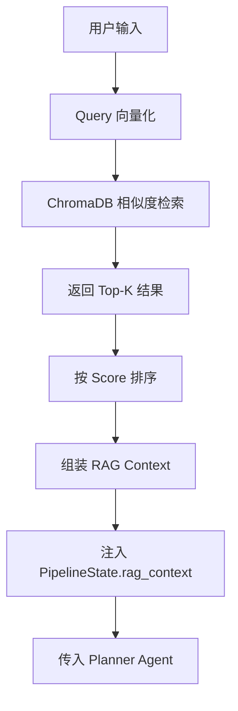
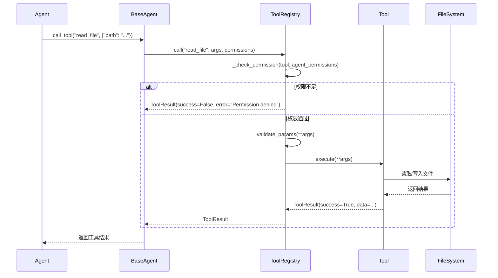

# BandCode — 基于分层记忆与六智能体协作的 AI 编程助手 — 设计与实现报告

## 一、项目概述

### 1.1 项目背景

随着大语言模型（LLM）在软件工程领域的广泛应用，AI 编程助手已成为提升开发效率的重要工具。然而，现有的 AI 编程工具普遍存在以下问题：

1. **缺乏项目记忆**：每次对话都是独立的，无法积累项目知识和约束，导致生成的代码反复违反项目规范。
2. **单一智能体架构**：所有任务由同一个模型处理，无法针对简单任务和复杂任务采用不同策略，造成资源浪费或能力不足。
3. **缺乏约束检查机制**：生成的代码可能违反项目编码规范、架构约定或安全策略，缺少自动化的合规检查。
4. **上下文丢失**：会话结束后，所有的上下文信息都会丢失，下次对话需要重新说明项目背景。

BandCode 正是为了解决上述问题而设计的。它采用**六智能体协作**架构，通过分层记忆系统持续积累项目知识，并通过约束检索与审查机制确保生成代码的合规性。

### 1.2 项目目标

BandCode 的核心目标是构建一个**具备项目记忆、多智能体协作和约束合规检查能力的 AI 编程助手**，具体包括：

| 目标 | 说明 |
|------|------|
| 分层记忆 | 实现 global / project / task / session / checkpoint / notes 六层记忆结构，持久化项目知识 |
| 六智能体协作 | 设计 Planner、SimpleCoder、ComplexCoder、Tester、Constraint、Review 六个专用智能体，各司其职 |
| 约束合规 | 通过 Constraint Agent 检索相关约束，Review Agent 检查输出合规性，自动修正违规代码 |
| RAG 知识库 | 基于 ChromaDB + SentenceTransformers 构建项目知识库，增强上下文理解能力 |
| 实时交互 | 通过 SSE 实现流式响应，实时展示 Agent 执行状态和中间结果 |
| 可扩展工具 | 提供 8 个内置工具，支持文件读写、项目搜索、知识库检索、任务管理和记忆更新 |

## 二、需求分析

### 2.1 用户痛点

| 痛点编号 | 痛点描述 | 影响程度 | 现有方案不足 |
|---------|---------|---------|------------|
| P1 | AI 不了解项目规范，生成的代码反复违反编码约定 | 高 | 需要每次对话重复说明，效率低下 |
| P2 | 所有任务使用同一模型，简单任务浪费资源，复杂任务能力不足 | 高 | 无法动态选择合适的模型和策略 |
| P3 | 生成的代码缺少自动化质量检查，潜在 Bug 难以发现 | 中 | 需要人工审查，增加开发负担 |
| P4 | 会话结束后上下文丢失，下次对话需要重新建立上下文 | 高 | 无法积累项目知识 |
| P5 | 无法追踪代码变更历史，出错后难以回滚 | 中 | 缺少版本控制集成 |
| P6 | 多人协作时，项目知识无法共享 | 中 | 知识停留在个人会话中 |

### 2.2 核心使用场景

| 场景编号 | 场景描述 | 涉及 Agent | 用户操作 |
|---------|---------|-----------|---------|
| S1 | 用户描述需求，AI 自动分析、规划、生成代码 | Planner → Coder | 输入自然语言需求 |
| S2 | 生成代码前自动检索项目约束，确保合规 | Constraint → Planner | 无需额外操作 |
| S3 | 生成代码后自动运行测试，检查质量 | Tester | 查看测试报告 |
| S4 | Review Agent 检查代码是否违反约束，自动修正 | Review → Coder | 确认修正方案 |
| S5 | 查看和搜索项目记忆，回顾历史决策 | Memory 系统 | 浏览记忆面板 |
| S6 | 配置 AI 模型参数、工作流选项 | Settings | 修改配置文件 |
| S7 | 简单任务快速处理（UI 修改、配置调整） | SimpleCoder | 输入简单需求 |
| S8 | 复杂任务深度处理（架构重构、API 开发） | ComplexCoder | 输入复杂需求 |

## 三、产品设计

### 3.1 功能架构

```
BandCode
├── 智能体系统
│   ├── Planner（规划调度）
│   ├── SimpleCoder（简单编码）
│   ├── ComplexCoder（复杂编码）
│   ├── Tester（测试验证）
│   ├── Constraint（约束检索）
│   └── Review（审查修正）
├── 工作流引擎
│   ├── Pipeline（主管线，8 节点）
│   ├── ReviewLoop（修正循环）
│   └── CheckpointManager（快照管理）
├── 记忆系统
│   ├── MemoryStore（六层存储）
│   ├── MemoryManager（统一管理）
│   ├── AutoRecorder（自动记录）
│   ├── SessionCompressor（会话压缩）
│   └── MemoryIndex（索引搜索）
├── RAG 知识库
│   ├── DocumentChunker（文档切分）
│   ├── RAGIndexer（索引构建）
│   └── RAGRetriever（向量检索）
├── 工具系统
│   ├── ToolRegistry（工具注册中心）
│   └── 8 个内置工具
├── API 服务
│   ├── /chat（SSE 流式聊天）
│   ├── /settings（配置管理）
│   ├── /memory（记忆操作）
│   ├── /project（项目管理）
│   ├── /tools（工具调用）
│   ├── /users（用户管理）
│   ├── /test（模型测试）
│   └── /workspace（工作区管理）
└── 前端界面
    ├── Chat（聊天面板）
    ├── Sidebar（侧边栏）
    ├── FileExplorer（文件浏览器）
    ├── MemoryView（记忆视图）
    ├── Settings（设置面板）
    └── History（历史记录）
```

### 3.2 功能清单

| 功能编号 | 功能名称 | 所属模块 | 优先级 | 描述 |
|---------|---------|---------|-------|------|
| F1 | 流式聊天 | API | P0 | 基于 SSE 的实时流式对话，支持 LLM 流式输出 |
| F2 | 六智能体协作 | Agent | P0 | Planner/Coder/Tester/Constraint/Review 六个 Agent 协同工作 |
| F3 | 分层记忆 | Memory | P0 | global/project/task/session/checkpoint/notes 六层记忆 |
| F4 | 约束检索 | Constraint | P0 | 从记忆中智能检索与当前任务相关的约束 |
| F5 | RAG 知识库 | RAG | P1 | 基于向量检索的项目知识库 |
| F6 | 代码审查 | Review | P0 | 自动检查生成代码是否违反项目约束 |
| F7 | 自动修正 | ReviewLoop | P1 | Review 失败时自动反馈修正，最多重试 3 次 |
| F8 | 快照回滚 | Checkpoint | P1 | 代码修改前创建快照，失败时可回滚 |
| F9 | 工具系统 | Tools | P0 | 8 个内置工具，支持文件操作、搜索、任务管理 |
| F10 | 配置管理 | Config | P1 | 模型参数、工作流选项的可视化配置 |
| F11 | 会话压缩 | Memory | P2 | 自动压缩过长的会话记录，节省存储空间 |
| F12 | 模型测试 | API | P2 | 测试 LLM 连通性和响应质量 |

## 四、技术架构设计

### 4.1 总体架构

BandCode 采用**四层架构**设计，各层职责清晰，通过定义良好的接口通信：

```
┌─────────────────────────────────────────────────────────┐
│                    表现层（Frontend）                      │
│  React 18 + TypeScript + Tailwind CSS + Vite            │
│  Chat / Sidebar / FileExplorer / MemoryView / Settings  │
├─────────────────────────────────────────────────────────┤
│                    接口层（API Layer）                     │
│  FastAPI + SSE (sse-starlette)                          │
│  /chat /settings /memory /project /tools /users         │
├─────────────────────────────────────────────────────────┤
│                    业务层（Business Layer）                │
│  ┌──────────┐ ┌──────────┐ ┌──────────┐ ┌──────────┐  │
│  │  Agent   │ │ Workflow │ │  Memory  │ │   RAG    │  │
│  │  System  │ │  Engine  │ │  System  │ │  System  │  │
│  └──────────┘ └──────────┘ └──────────┘ └──────────┘  │
│  ┌──────────┐ ┌──────────┐ ┌──────────┐               │
│  │  Tools   │ │  Models  │ │  Config  │               │
│  │  System  │ │  Layer   │ │  Loader  │               │
│  └──────────┘ └──────────┘ └──────────┘               │
├─────────────────────────────────────────────────────────┤
│                    数据层（Data Layer）                    │
│  SQLite（会话/消息/任务/快照）                             │
│  ChromaDB（向量知识库）                                    │
│  文件系统（Memory Markdown / 配置 JSON）                   │
└─────────────────────────────────────────────────────────┘
```

### 4.2 技术选型

| 技术领域 | 技术选型 | 版本 | 选型理由 |
|---------|---------|------|---------|
| 后端框架 | FastAPI | >= 0.100 | 异步支持优秀，自动生成 OpenAPI 文档，Pydantic 数据验证 |
| ASGI 服务器 | Uvicorn | >= 0.23 | 高性能异步服务器，FastAPI 官方推荐 |
| 前端框架 | React | 18.2 | 组件化开发，生态丰富，TypeScript 支持好 |
| 类型系统 | TypeScript | >= 5.3 | 静态类型检查，减少运行时错误 |
| CSS 框架 | Tailwind CSS | >= 3.4 | 原子化 CSS，开发效率高，体积小 |
| 构建工具 | Vite | >= 5.0 | 极速热更新，ESM 原生支持 |
| 状态管理 | Zustand | >= 4.4 | 轻量级，无 Boilerplate，TypeScript 友好 |
| 大模型 | MiMo v2.5 Pro | - | 小米自研模型，通过 OpenAI 兼容 API 调用 |
| LLM 客户端 | OpenAI SDK | >= 1.0 | 标准化接口，支持流式输出 |
| 向量数据库 | ChromaDB | >= 0.4 | 轻量级，嵌入式部署，无需额外服务 |
| Embedding | SentenceTransformers | >= 2.2 | 丰富的预训练模型，all-MiniLM-L6-v2 轻量高效 |
| 关系数据库 | SQLite | 内置 | 零配置，适合本地部署，Python 原生支持 |
| SSE | sse-starlette | >= 1.6 | Starlette 原生 SSE 支持，与 FastAPI 无缝集成 |
| 测试框架 | pytest | >= 7.0 | 简洁的断言语法，丰富的插件生态 |

### 4.3 Pipeline 工作流设计

BandCode 的核心工作流采用 **8 节点顺序管线** 设计，每个节点完成一个特定的处理阶段：

```
用户输入
  │
  ▼
┌──────────────────┐
│ 1. 约束检索       │  Constraint Agent 从 Memory 中筛选相关约束
│    (Constraint)   │
└────────┬─────────┘
         │
         ▼
┌──────────────────┐
│ 2. RAG 检索       │  从 ChromaDB 向量数据库检索相关知识
│    (RAG)          │
└────────┬─────────┘
         │
         ▼
┌──────────────────┐
│ 3. Prompt 构建    │  将约束、RAG 上下文、记忆组装为完整 Prompt
│    (Prompt Build) │
└────────┬─────────┘
         │
         ▼
┌──────────────────┐
│ 4. Planner 调度   │  需求分析、任务拆解、选择子 Agent
│    (Planner)      │
└────────┬─────────┘
         │
         ▼
┌──────────────────┐
│ 5. 审批检查       │  高风险操作请求用户确认（可选）
│    (Approval)     │
└────────┬─────────┘
         │
         ▼
┌──────────────────┐
│ 6. 子 Agent 执行  │  SimpleCoder 或 ComplexCoder 执行代码生成
│    (SubAgent)     │
└────────┬─────────┘
         │
         ▼
┌──────────────────┐
│ 7. Tester 验证    │  编译检查、单元测试、静态分析
│    (Tester)       │
└────────┬─────────┘
         │
         ▼
┌──────────────────┐
│ 8. Review 审查    │  检查输出是否违反项目约束
│    (Review)       │  若不通过 → 回到步骤 4 重新生成
└────────┬─────────┘
         │
         ▼
      输出结果
```

Pipeline 的核心实现如下：

```python
class Pipeline:
    """主工作流管线"""

    def __init__(self, config: dict = None):
        self.config = config or DEFAULT_CONFIG.copy()
        self.nodes: list[Callable] = []
        self._init_default_nodes()

    def _init_default_nodes(self) -> None:
        """初始化默认节点列表"""
        self.nodes = [
            self.node_constraint,    # 节点1: 约束检索
            self.node_rag,           # 节点2: RAG 检索
            self.node_prompt_build,  # 节点3: Prompt 构建
            self.node_planner,       # 节点4: Planner 调度
            self.node_approval,      # 节点5: 审批检查
            self.node_subagent,      # 节点6: 子 Agent 执行
            self.node_tester,        # 节点7: Tester 验证
            self.node_review,        # 节点8: Review 审查
        ]

    async def run(self, state: PipelineState) -> PipelineState:
        """执行主管线"""
        for node in self.nodes:
            if state.done or state.error:
                break
            try:
                state = await node(state)
            except Exception as e:
                state.error = f"节点 {node.__name__} 执行失败: {str(e)}"
                break
        return state
```

**Review 修正循环**：当 Review Agent 发现违规时，系统会自动将违规信息反馈给 Planner 重新生成代码，最多重试 3 次。超过最大次数后，可自动回滚到修改前的快照状态。

```python
class ReviewLoop:
    """Review 修正循环管理器"""

    async def run(self, state, review_fn, fix_fn, rollback_fn=None):
        for attempt in range(self.max_retries):
            state = await review_fn(state)
            if state.review_result and state.review_result.get("passed", True):
                return state

            if not self.auto_fix:
                state.error = f"Review 未通过: {state.review_result.get('violations', [])}"
                return state

            violations = state.review_result.get("violations", [])
            fix_prompt = self._build_fix_prompt(violations)
            state.user_input = fix_prompt
            state.retry_count += 1
            state = await fix_fn(state)

        # 达到最大修正次数
        if self.auto_rollback and rollback_fn:
            state = await rollback_fn(state)
            state.error = "修正失败，已自动回滚到修改前状态"
        return state
```

### 4.4 Agent 系统设计

BandCode 的 Agent 系统采用**基类继承 + 自动发现**的架构。所有 Agent 继承 `BaseAgent` 基类，通过 `AgentManager` 自动扫描目录并注册。

**PipelineState 状态传递**：所有 Agent 共享同一个 `PipelineState` 数据结构，通过状态传递实现节点间通信，类似 LangGraph 的 StateGraph 设计。

```python
@dataclass
class PipelineState:
    """贯穿整个工作流的状态数据结构"""
    # 输入
    user_input: str = ""
    session_id: str = ""
    project: str = ""

    # Constraint Agent 输出
    constraints: list[str] = field(default_factory=list)
    constraint_summary: str = ""

    # RAG 输出
    rag_context: str = ""

    # Memory 上下文
    memory_context: dict = field(default_factory=dict)
    # 结构: {"global": "...", "project": "...", "task": "..."}

    # Planner 输出
    plan: Optional[dict] = None
    # 结构: {"tasks": [...], "delegated_agent": "simple-coder", "reason": "..."}

    # 子 Agent 输出
    agent_output: Optional[dict] = None
    test_result: Optional[dict] = None
    review_result: Optional[dict] = None

    # 流程控制
    current_step: str = "init"
    retry_count: int = 0
    max_retries: int = 3
    error: Optional[str] = None
    done: bool = False
```

**AgentManager 自动发现机制**：扫描 `agents/` 目录下所有 Python 文件，动态导入模块，查找 `BaseAgent` 的子类并自动实例化注册。

```python
class AgentManager:
    def auto_discover(self, agents_dir: str = None):
        """自动扫描agents/目录，注册所有Agent"""
        for file_path in Path(agents_dir).glob("*.py"):
            if file_path.name.startswith("_") or file_path.name in ["base.py", "manager.py"]:
                continue
            module = importlib.import_module(f"agents.{file_path.stem}")
            for attr_name in dir(module):
                attr = getattr(module, attr_name)
                if isinstance(attr, type) and issubclass(attr, BaseAgent) and attr is not BaseAgent:
                    agent = attr(self.llm_client)
                    self.register(agent)
```

## 五、RAG 知识库设计

### 5.1 数据来源

BandCode 的 RAG 知识库支持以下数据来源：

| 数据来源 | 格式 | 说明 |
|---------|------|------|
| 项目文档 | Markdown | README、设计文档、API 文档等 |
| 代码文件 | 源代码 | 通过文档切分后索引 |
| Agent 定义 | Markdown | agents/ 目录下的 Agent 描述文件 |
| 工具定义 | JSON | tools/ 目录下的工具 Schema 文件 |
| Memory 记录 | Markdown | 六层 Memory 中的结构化知识 |

### 5.2 文档加载

`RAGIndexer` 支持三种加载方式：

```python
class RAGIndexer:
    def index_documents(self, documents: list[str], metadatas=None) -> int:
        """索引多条文档，返回索引的 chunk 数量"""
        all_chunks = []
        for i, doc in enumerate(documents):
            meta = metadatas[i] if metadatas else {"source": f"doc_{i}"}
            chunks = self.chunker.chunk_by_paragraph(doc)
            for chunk in chunks:
                chunk.metadata.update(meta)
                all_chunks.append(chunk)
        # 批量向量化并存入 ChromaDB
        texts = [c.content for c in all_chunks]
        embeddings = self.embedding_client.embed_batch(texts)
        self.collection.add(ids=ids, documents=texts, embeddings=embeddings, metadatas=all_metadatas)
        return len(all_chunks)

    def index_file(self, file_path: str) -> int:
        """索引单个文件"""
        content = Path(file_path).read_text(encoding="utf-8")
        return self.index_documents([content], [{"source": file_path}])

    def index_directory(self, dir_path: str, pattern: str = "*.md") -> int:
        """索引目录下所有匹配的文件"""
        total = 0
        for file_path in Path(dir_path).glob(pattern):
            total += self.index_file(str(file_path))
        return total
```

### 5.3 文本切分

`DocumentChunker` 提供两种切分策略：

- **按段落切分**：以 `\n\n` 为分隔符，适合结构化文档
- **按句子切分**：以句号、感叹号、问号为分隔符，适合连续文本

```python
class DocumentChunker:
    def __init__(self, max_chunk_size: int = 1000, overlap: int = 100):
        self.max_chunk_size = max_chunk_size
        self.overlap = overlap

    def chunk_by_paragraph(self, text: str) -> list[TextChunk]:
        """按段落切分文档"""
        paragraphs = [p.strip() for p in text.split("\n\n") if p.strip()]
        chunks = []
        for i, para in enumerate(paragraphs):
            if len(para) > self.max_chunk_size:
                sub_chunks = self._split_long_text(para)
                for j, sub in enumerate(sub_chunks):
                    chunks.append(TextChunk(content=sub, index=len(chunks),
                                           metadata={"paragraph": i, "sub_index": j}))
            else:
                chunks.append(TextChunk(content=para, index=i, metadata={"paragraph": i}))
        return chunks
```

对于超过 `max_chunk_size` 的长文本，系统会在句号处智能断开，并保留 100 字符的重叠区域以维持上下文连贯性。

### 5.4 Embedding

BandCode 使用 `SentenceTransformers` 的 `all-MiniLM-L6-v2` 模型进行文本向量化：

- **模型维度**：384 维
- **支持模型**：all-MiniLM-L6-v2（默认）、all-mpnet-base-v2（768 维）、paraphrase-multilingual-MiniLM-L12-v2（384 维，多语言）
- **调用方式**：支持单条和批量向量化

```python
class EmbeddingClient:
    def __init__(self, model_name: str = "all-MiniLM-L6-v2"):
        self.model = SentenceTransformer(model_name)
        self.dimension = 384

    def embed(self, text: str) -> list[float]:
        """单条文本向量化"""
        return self.model.encode(text, convert_to_numpy=True).tolist()

    def embed_batch(self, texts: list[str]) -> list[list[float]]:
        """批量文本向量化"""
        return self.model.encode(texts, convert_to_numpy=True).tolist()
```

### 5.5 向量数据库

BandCode 使用 ChromaDB 作为向量数据库：

- **部署模式**：嵌入式（PersistentClient），无需额外服务
- **存储路径**：`./chroma` 目录
- **距离度量**：cosine 余弦相似度
- **Collection**：默认使用 `knowledge` 集合

```python
class RAGRetriever:
    def __init__(self, chroma_path="./chroma", collection_name="knowledge"):
        self.client = chromadb.PersistentClient(path=chroma_path)
        self.collection = self.client.get_or_create_collection(
            name=collection_name,
            metadata={"hnsw:space": "cosine"}
        )

    def search(self, query: str, top_k: int = 5) -> list[SearchResult]:
        """相似度检索"""
        query_embedding = self.embedding_client.embed(query)
        results = self.collection.query(
            query_embeddings=[query_embedding],
            n_results=min(top_k, self.collection.count())
        )
        # 组装结果
        search_results = []
        for i, doc in enumerate(results["documents"][0]):
            score = 1 - results["distances"][0][i]
            search_results.append(SearchResult(content=doc, score=score))
        return search_results
```

### 5.6 检索流程



完整的 RAG 检索流程：

1. **用户输入**：获取用户的查询文本
2. **Query 向量化**：使用 EmbeddingClient 将查询文本转换为 384 维向量
3. **ChromaDB 检索**：在向量数据库中执行 cosine 相似度检索
4. **返回 Top-K**：默认返回最相关的 5 个结果
5. **Score 计算**：`score = 1 - distance`，值越大越相关
6. **组装上下文**：将检索结果拼接为文本，注入 PipelineState
7. **传递下游**：Planner Agent 使用 RAG 上下文辅助决策

## 六、Agent 与工具调用设计

### 6.1 Agent 基类设计

所有 Agent 继承 `BaseAgent` 基类，提供统一的接口和基础能力：

```python
class BaseAgent(ABC):
    name: str = "base"           # Agent 名称
    description: str = ""        # Agent 描述
    model: str = "mimo-v2.5-pro" # 使用的 LLM 模型
    temperature: float = 0.1     # 生成温度
    system_prompt: str = ""      # 系统 Prompt
    permissions: dict = {}       # 工具权限配置

    @abstractmethod
    async def run(self, state: PipelineState) -> PipelineState:
        """执行 Agent 逻辑（子类必须实现）"""
        raise NotImplementedError

    async def call_llm(self, messages, temperature=None, max_tokens=None) -> str:
        """调用 LLM"""
        return await self.llm.chat(messages, temperature=temp)

    async def call_tool(self, tool_name: str, args: dict) -> Any:
        """调用 Tool（通过 ToolRegistry 权限校验后执行）"""
        return await self._tool_registry.call(tool_name, args, self.permissions)

    def report_status(self, status: str, data: dict = None):
        """上报状态（通过回调函数推送到 SSE）"""
        if self._status_callback:
            self._status_callback({"agent": self.name, "status": status, "data": data})
```

### 6.2 六个 Agent 详解

#### 6.2.1 Planner Agent（规划调度智能体）

- **职责**：需求分析、任务拆解、Agent 调度
- **模型**：mimo-v2.5-pro
- **温度**：0.3
- **权限**：read / edit / bash 均为 allow
- **步骤上限**：20 步
- **工作流程**：
  1. 需求分析：理解用户目标，结合 Constraint Agent 提供的约束
  2. 任务拆解：将复杂任务分解为可执行的子任务
  3. Agent 选择：根据任务复杂度选择 SimpleCoder 或 ComplexCoder

**Agent 选择规则**：

| 任务类型 | 委派 Agent | 说明 |
|---------|-----------|------|
| UI 修改、配置调整、单文件修改 | SimpleCoder | 低复杂度，快速处理 |
| API 开发、架构调整、跨模块重构 | ComplexCoder | 高复杂度，深度分析 |
| 测试验证 | Tester | 编译检查、单元测试 |

```python
class PlannerAgent(BaseAgent):
    name = "planner"
    description = "规划调度智能体"
    model = "mimo-v2.5-pro"
    temperature = 0.3

    async def run(self, state: PipelineState) -> PipelineState:
        # 1. 需求分析
        analysis = await self._analyze_requirement(state)
        # 2. 任务拆解
        tasks = await self._decompose_tasks(analysis, state)
        # 3. 选择子 Agent
        delegated_agent, reason = self._select_agent(tasks, analysis)
        # 4. 输出计划
        state.plan = {
            "tasks": tasks,
            "delegated_agent": delegated_agent,
            "reason": reason,
            "analysis": analysis
        }
        return state
```

#### 6.2.2 SimpleCoder Agent（简单编码智能体）

- **职责**：UI 修改、配置调整、单文件修改、小型 Bug 修复
- **模型**：mimo-v2.5
- **温度**：0.2
- **自动升级阈值**：文件数 > 2 或代码行数 > 300 或复杂度为 high 时，自动升级到 ComplexCoder

```python
class SimpleCoderAgent(BaseAgent):
    name = "simple-coder"
    description = "简单编码智能体"
    model = "mimo-v2.5"
    temperature = 0.2
    max_files = 2
    max_lines = 300

    async def run(self, state: PipelineState) -> PipelineState:
        task_analysis = await self._analyze_task(state)
        if self._should_upgrade(task_analysis):
            state.plan["delegated_agent"] = "complex-coder"
            return state
        code = await self._generate_code(task_analysis, state)
        state.code = code
        return state
```

#### 6.2.3 ComplexCoder Agent（复杂编码智能体）

- **职责**：核心业务逻辑、API 开发、架构调整、跨模块重构
- **模型**：mimo-v2.5-pro
- **温度**：0.1（更保守，适合复杂任务）
- **工作流程**：架构分析 → 方案设计 → 代码生成 → 应用变更

```python
class ComplexCoderAgent(BaseAgent):
    name = "complex-coder"
    description = "复杂编码智能体"
    model = "mimo-v2.5-pro"
    temperature = 0.1

    async def run(self, state: PipelineState) -> PipelineState:
        architecture = await self._analyze_architecture(state)
        design = await self._design_solution(architecture, state)
        code = await self._generate_code(design, state)
        state.code = code
        return state
```

#### 6.2.4 Tester Agent（测试验证智能体）

- **职责**：编译检查、单元测试、静态分析
- **模型**：mimo-v2.5
- **温度**：0（确定性输出）
- **硬约束**：`edit = deny`，禁止修改任何代码文件
- **输出**：测试报告（编译状态、测试通过率、质量分数）

```python
class TesterAgent(BaseAgent):
    name = "tester"
    description = "测试验证智能体"
    permissions = {"read": "allow", "edit": "deny", "bash": "allow"}

    async def run(self, state: PipelineState) -> PipelineState:
        compile_result = await self._check_compilation(state)
        test_result = await self._run_tests(state)
        analysis_result = await self._static_analysis(state)
        report = self._generate_report(compile_result, test_result, analysis_result)
        state.test_results = report
        return state
```

#### 6.2.5 Constraint Agent（约束检索智能体）

- **职责**：从六层 Memory 中智能检索与当前任务相关的约束
- **模型**：mimo-v2.5
- **温度**：0.1
- **权限**：read / edit / bash 均为 deny（只读）
- **工作流程**：
  1. 解析用户意图（LLM 提取关键词）
  2. 搜索各层 Memory（global / project / task）
  3. 去重 + 按相关性排序
  4. 取 Top-K 约束
  5. 生成约束摘要

```python
class ConstraintAgent(BaseAgent):
    name = "constraint"
    description = "约束检索智能体"
    permissions = {"read": "allow", "edit": "deny", "bash": "deny"}
    max_constraints = 10

    async def run(self, state: PipelineState) -> PipelineState:
        intent = await self._parse_intent(state.user_input)
        all_constraints = await self._search_constraints(intent, state)
        unique_constraints = self._deduplicate(all_constraints)
        ranked_constraints = self._rank_by_relevance(unique_constraints, intent)
        top_constraints = ranked_constraints[:self.max_constraints]
        summary = await self._generate_summary(top_constraints)
        state.constraints = top_constraints
        state.constraint_summary = summary
        return state
```

#### 6.2.6 Review Agent（审查修正智能体）

- **职责**：检查生成的代码是否违反项目约束
- **模型**：mimo-v2.5
- **温度**：0（确定性输出）
- **权限**：read / edit / bash 均为 deny（只读）
- **检查内容**：
  1. 代码合规性：使用 LLM 检查代码是否违反约束
  2. 文件合规性：检查是否修改了禁止修改的文件（settings.json、.env、*.key、*.pem）

```python
class ReviewAgent(BaseAgent):
    name = "review"
    description = "约束审查智能体"
    permissions = {"read": "allow", "edit": "deny", "bash": "deny"}

    async def check_compliance(self, agent_output, constraints) -> ReviewResult:
        violations = []
        if "code" in agent_output:
            code_violations = await self._check_code_compliance(agent_output["code"], constraints)
            violations.extend(code_violations)
        if "files_changed" in agent_output:
            file_violations = self._check_file_compliance(agent_output["files_changed"], constraints)
            violations.extend(file_violations)
        return ReviewResult(passed=len(violations) == 0, violations=violations)
```

### 6.3 工具设计

BandCode 提供 8 个内置工具，每个工具定义在独立的 JSON 文件中，通过 `ToolRegistry` 自动发现和注册。

| 工具名称 | 权限 | 参数 | 说明 |
|---------|------|------|------|
| `read_file` | read | `path: string` | 读取指定路径的文件内容 |
| `write_file` | write | `path: string, content: string` | 写入文件内容 |
| `list_directory` | read | `path: string` | 列出目录下的文件和子目录 |
| `search_project` | read | `query: string, pattern?: string` | 在项目中搜索文件或内容 |
| `search_knowledge` | read | `query: string, top_k?: int` | 搜索 RAG 知识库 |
| `create_task` | write | `title: string, description?: string` | 创建新任务 |
| `finish_task` | write | `task_id: string, status: string` | 完成任务 |
| `update_memory` | write | `layer: string, content: string` | 更新 Memory 层级 |

**工具基类设计**：

```python
class Tool(ABC):
    name: str = "base"
    description: str = "基础工具"
    permission: str = "read"  # read / write / bash / admin
    parameters: dict = {}     # JSON Schema 格式

    @abstractmethod
    async def execute(self, **kwargs) -> ToolResult:
        raise NotImplementedError

    def validate_params(self, **kwargs) -> bool:
        """验证必需参数"""
        for param_name, param_info in self.parameters.items():
            if param_info.get("required", False) and param_name not in kwargs:
                return False
        return True
```

**ToolRegistry 权限校验**：每次工具调用前，都会检查 Agent 是否拥有该工具所需的权限。

```python
class ToolRegistry:
    async def call(self, name: str, args: dict, agent_permissions: dict) -> ToolResult:
        tool = self.get(name)
        if not self._check_permission(tool, agent_permissions):
            return ToolResult(success=False, error="Permission denied")
        if not tool.validate_params(**args):
            return ToolResult(success=False, error="Invalid parameters")
        return await tool.execute(**args)
```

### 6.4 工具调用流程



## 七、系统实现

### 7.1 项目结构

```
bandcode/
├── agents/                        # Agent 定义文件（Markdown）
│   ├── planner.md                 # Planner Agent 描述
│   ├── simple-coder.md            # SimpleCoder Agent 描述
│   ├── complex-coder.md           # ComplexCoder Agent 描述
│   ├── tester.md                  # Tester Agent 描述
│   ├── constraint.md              # Constraint Agent 描述
│   └── review.md                  # Review Agent 描述
├── tools/                         # 工具定义文件（JSON Schema）
│   ├── read_file.json
│   ├── write_file.json
│   ├── list_directory.json
│   ├── search_project.json
│   ├── search_knowledge.json
│   ├── create_task.json
│   ├── finish_task.json
│   └── update_memory.json
├── memory/                        # Memory 存储目录
│   ├── global/                    # 全局 Memory
│   ├── projects/                  # 项目 Memory
│   ├── sessions/                  # 会话 Memory
│   └── index.json                 # Memory 索引
├── backend/                       # 后端代码
│   ├── main.py                    # FastAPI 入口
│   ├── agents/                    # Agent 实现
│   │   ├── base.py                # Agent 基类 + PipelineState
│   │   ├── manager.py             # Agent 管理器
│   │   ├── planner.py             # Planner Agent
│   │   ├── simple_coder.py        # SimpleCoder Agent
│   │   ├── complex_coder.py       # ComplexCoder Agent
│   │   ├── tester.py              # Tester Agent
│   │   ├── constraint.py          # Constraint Agent
│   │   └── review.py              # Review Agent
│   ├── api/                       # API 路由
│   │   ├── chat.py                # 聊天 API（SSE）
│   │   ├── sse.py                 # SSE 事件系统
│   │   ├── settings.py            # 设置 API
│   │   ├── memory.py              # Memory API
│   │   ├── project.py             # 项目 API
│   │   ├── tools.py               # 工具 API
│   │   ├── users.py               # 用户 API
│   │   ├── test.py                # 测试 API
│   │   ├── workspace.py           # 工作区 API
│   │   ├── middleware.py           # 中间件
│   │   └── errors.py              # 错误处理
│   ├── workflow/                   # 工作流引擎
│   │   ├── pipeline.py            # 主管线（8 节点）
│   │   ├── state.py               # PipelineState
│   │   ├── review_loop.py         # Review 修正循环
│   │   └── checkpoint.py          # 快照管理
│   ├── memory/                    # Memory 系统
│   │   ├── store.py               # 六层 Memory 存储
│   │   ├── manager.py             # Memory 管理器
│   │   ├── auto_recorder.py       # 自动记录器
│   │   ├── compressor.py          # 会话压缩器
│   │   ├── index.py               # Memory 索引
│   │   └── builder.py             # Memory 构建器
│   ├── rag/                       # RAG 知识库
│   │   ├── chunker.py             # 文档切分器
│   │   ├── indexer.py             # 索引构建器
│   │   └── retriever.py           # 向量检索器
│   ├── tools/                     # 工具系统
│   │   ├── base.py                # Tool 基类
│   │   ├── registry.py            # Tool 注册中心
│   │   └── builtins/              # 内置工具实现
│   │       ├── read_file.py
│   │       ├── write_file.py
│   │       ├── list_directory.py
│   │       ├── search_project.py
│   │       ├── search_knowledge.py
│   │       ├── create_task.py
│   │       ├── finish_task.py
│   │       └── update_memory.py
│   ├── models/                    # 模型封装
│   │   ├── llm.py                 # LLM 客户端（OpenAI 兼容）
│   │   ├── embedding.py           # Embedding 客户端
│   │   ├── requests.py            # 请求模型
│   │   └── responses.py           # 响应模型
│   ├── database/                  # 数据库
│   │   ├── models.py              # 表结构定义
│   │   └── crud.py                # CRUD 操作
│   ├── config/                    # 配置
│   │   ├── loader.py              # 配置加载器
│   │   └── logging.py             # 日志配置
│   ├── tests/                     # 测试
│   │   ├── test_agents.py
│   │   ├── test_api.py
│   │   ├── test_constraint.py
│   │   ├── test_database.py
│   │   ├── test_embedding.py
│   │   ├── test_llm.py
│   │   ├── test_main.py
│   │   ├── test_memory.py
│   │   ├── test_rag.py
│   │   ├── test_review.py
│   │   ├── test_tools.py
│   │   └── test_workflow.py
│   └── requirements.txt
├── frontend-web/                  # 前端代码（React）
│   ├── src/
│   │   ├── App.tsx                # 应用入口
│   │   ├── main.tsx               # 渲染入口
│   │   ├── index.css              # 全局样式
│   │   └── components/            # UI 组件
│   │       ├── Chat.tsx           # 聊天面板
│   │       ├── Sidebar.tsx        # 侧边栏
│   │       ├── FileExplorer.tsx   # 文件浏览器
│   │       ├── MemoryView.tsx     # Memory 视图
│   │       ├── Settings.tsx       # 设置面板
│   │       ├── History.tsx        # 历史记录
│   │       ├── CommandPalette.tsx # 命令面板
│   │       ├── ModelTest.tsx      # 模型测试
│   │       └── WorkspaceInfo.tsx  # 工作区信息
│   ├── package.json
│   ├── vite.config.ts
│   ├── tailwind.config.js
│   └── tsconfig.json
├── settings.json                  # 全局配置文件
├── settings.example.json          # 配置示例
├── start.ps1                      # Windows 启动脚本
├── start.sh                       # Linux/Mac 启动脚本
└── requirements.txt               # Python 依赖
```

### 7.2 核心模块实现

#### 7.2.1 FastAPI 应用入口

```python
# backend/main.py
from fastapi import FastAPI
from fastapi.middleware.cors import CORSMiddleware
from api.errors import register_error_handlers
from api.middleware import RequestLoggingMiddleware, SecurityHeadersMiddleware

app = FastAPI(
    title="BandCode",
    description="基于分层记忆与六智能体协作的 AI 编程助手",
    version="1.0.0",
)

# CORS 配置
app.add_middleware(
    CORSMiddleware,
    allow_origins=["*"],
    allow_credentials=True,
    allow_methods=["*"],
    allow_headers=["*"],
)

# 自定义中间件
app.add_middleware(SecurityHeadersMiddleware)
app.add_middleware(RequestLoggingMiddleware)

# 注册路由
from api.chat import router as chat_router
from api.settings import router as settings_router
from api.memory import router as memory_router
# ... 其他路由

app.include_router(chat_router, prefix="/api")
app.include_router(settings_router, prefix="/api")
app.include_router(memory_router, prefix="/api")
```

#### 7.2.2 SSE 流式聊天实现

SSE 是 BandCode 的核心通信机制，定义了 12 种事件类型：

```python
class SSEEventType:
    AGENT_START = "agent_start"           # Agent 开始执行
    CONSTRAINT_RESULT = "constraint_result" # 约束检索结果
    PLAN = "plan"                         # Planner 输出计划
    APPROVAL_REQUIRED = "approval_required" # 需要用户审批
    APPROVAL_RESPONSE = "approval_response" # 用户审批响应
    TOOL_CALL = "tool_call"               # Tool 调用
    CODE = "code"                         # 代码生成
    TEST_RESULT = "test_result"           # 测试结果
    REVIEW_RESULT = "review_result"       # 审查结果
    MEMORY_UPDATE = "memory_update"       # Memory 更新
    TEXT = "text"                         # LLM 流式文本
    DONE = "done"                         # 任务完成
    ERROR = "chat_error"                  # 错误
```

聊天流程的 SSE 事件推送：

```python
async def process_chat(session_id, project, message, event_queue):
    # 1. Constraint Agent 检索约束
    await push_agent_start(event_queue, "constraint", "running")
    await push_constraint_result(event_queue, constraints=[...], summary="...")

    # 2. Planner Agent 分析需求
    await push_agent_start(event_queue, "planner", "running")
    await push_plan(event_queue, tasks=[...], delegated_agent="complex_coder")

    # 3. 调用 LLM 流式生成回复
    await push_agent_start(event_queue, "complex_coder", "running")
    async for chunk in llm_client.chat_stream(messages):
        await push_text(event_queue, chunk, agent="complex_coder")

    # 4. 更新 Memory
    await push_memory_update(event_queue, layers=["session", "checkpoint"])

    # 5. 完成
    await push_done(event_queue, session_id, "已处理消息")
```

#### 7.2.3 六层 Memory 存储实现

```python
class MemoryStore:
    """分层 Memory 存储管理器"""

    LAYERS = ["global", "project", "tasks", "sessions", "checkpoints", "notes"]

    def __init__(self, project_path: str):
        self.base_path = Path(project_path) / ".mimo"

    def get_memory(self, layer: str, session_id: str = None) -> str:
        """读取指定层级的 Memory"""
        if layer == "global":
            return self._read_file(self.base_path / "global" / "MEMORY.md")
        elif layer == "project":
            return self._read_file(self.base_path / "project" / "MEMORY.md")
        elif layer == "task":
            return self._read_file(self.base_path / "tasks" / f"task-{session_id}.md")
        elif layer == "session":
            return self._read_file(self.base_path / "sessions" / f"{session_id}.md")
        elif layer == "checkpoint":
            files = sorted((self.base_path / "checkpoints").glob(f"{session_id}-*.md"), reverse=True)
            return self._read_file(files[0]) if files else ""
        elif layer == "notes":
            return self._read_file(self.base_path / "notes" / "NOTES.md")

    def search_all_layers(self, query: str) -> dict[str, list[str]]:
        """在所有层级中搜索"""
        results = {}
        for layer in ["global", "project", "task", "notes"]:
            matches = self.search_memory(layer, query)
            if matches:
                results[layer] = matches
        return results
```

#### 7.2.4 LLM 客户端封装

BandCode 通过 OpenAI 兼容 API 调用 MiMo v2.5 Pro 模型，支持流式和非流式两种调用方式：

```python
class LLMClient:
    def __init__(self, base_url: str, api_key: str, model: str):
        self.client = AsyncOpenAI(
            base_url=base_url,
            api_key=api_key,
            timeout=60,
            max_retries=3
        )

    async def chat(self, messages, temperature=0.1, max_tokens=None) -> str:
        """非流式对话"""
        response = await self.client.chat.completions.create(
            model=self.model, messages=messages, temperature=temperature
        )
        return response.choices[0].message.content

    async def chat_stream(self, messages, temperature=0.1, max_tokens=None):
        """流式对话"""
        stream = await self.client.chat.completions.create(
            model=self.model, messages=messages, temperature=temperature, stream=True
        )
        async for chunk in stream:
            if chunk.choices and chunk.choices[0].delta.content:
                yield chunk.choices[0].delta.content
```

#### 7.2.5 数据库表结构

BandCode 使用 SQLite 存储运行时数据，共 4 张表：

```sql
-- 会话表
CREATE TABLE sessions (
    session_id TEXT PRIMARY KEY,
    project TEXT NOT NULL,
    created_at TIMESTAMP DEFAULT CURRENT_TIMESTAMP,
    updated_at TIMESTAMP DEFAULT CURRENT_TIMESTAMP,
    status TEXT DEFAULT 'active'
);

-- 消息表
CREATE TABLE messages (
    id INTEGER PRIMARY KEY AUTOINCREMENT,
    session_id TEXT NOT NULL,
    role TEXT NOT NULL,
    agent TEXT,
    content TEXT NOT NULL,
    created_at TIMESTAMP DEFAULT CURRENT_TIMESTAMP,
    FOREIGN KEY (session_id) REFERENCES sessions(session_id)
);

-- 任务表
CREATE TABLE tasks (
    task_id TEXT PRIMARY KEY,
    session_id TEXT NOT NULL,
    title TEXT NOT NULL,
    description TEXT,
    status TEXT DEFAULT 'pending',
    created_at TIMESTAMP DEFAULT CURRENT_TIMESTAMP,
    completed_at TIMESTAMP,
    FOREIGN KEY (session_id) REFERENCES sessions(session_id)
);

-- 快照表
CREATE TABLE checkpoints (
    checkpoint_id TEXT PRIMARY KEY,
    session_id TEXT NOT NULL,
    description TEXT,
    files_changed TEXT,
    snapshot_path TEXT,
    created_at TIMESTAMP DEFAULT CURRENT_TIMESTAMP,
    FOREIGN KEY (session_id) REFERENCES sessions(session_id)
);
```

## 八、测试与验证

### 8.1 功能测试

BandCode 的测试覆盖了所有核心模块，共 12 个测试文件：

| 测试文件 | 测试对象 | 测试内容 |
|---------|---------|---------|
| `test_agents.py` | Agent 系统 | Agent 基类、AgentManager 自动发现、Agent 执行 |
| `test_api.py` | API 接口 | 聊天接口、设置接口、Memory 接口、工具接口 |
| `test_constraint.py` | Constraint Agent | 意图解析、约束检索、去重排序、摘要生成 |
| `test_database.py` | 数据库 | 表创建、CRUD 操作、事务处理 |
| `test_embedding.py` | Embedding | 单条向量化、批量向量化、维度验证 |
| `test_llm.py` | LLM 客户端 | 非流式调用、流式调用、错误处理 |
| `test_main.py` | 应用入口 | 健康检查、路由注册、中间件配置 |
| `test_memory.py` | Memory 系统 | 六层读写、搜索、压缩、索引 |
| `test_rag.py` | RAG 知识库 | 文档切分、索引构建、向量检索 |
| `test_review.py` | Review Agent | 代码合规检查、文件合规检查、违规报告 |
| `test_tools.py` | 工具系统 | 工具注册、权限校验、参数验证、执行 |
| `test_workflow.py` | 工作流 | Pipeline 执行、ReviewLoop 修正、Checkpoint 回滚 |

### 8.2 性能测试

| 测试指标 | 测试场景 | 预期结果 | 测试方法 |
|---------|---------|---------|---------|
| LLM 响应时间 | 单次非流式调用 | < 5s | 测量 `chat()` 耗时 |
| SSE 首字节时间 | 流式聊天首 token | < 1s | 测量 `chat_stream()` 首个 chunk |
| RAG 检索延迟 | Top-5 向量检索 | < 500ms | 测量 `search()` 耗时 |
| Memory 读取延迟 | 单层 Memory 读取 | < 100ms | 测量 `get_memory()` 耗时 |
| Pipeline 执行时间 | 完整 8 节点流程 | < 30s | 测量 `Pipeline.run()` 耗时 |
| Embedding 批量处理 | 100 条文本向量化 | < 5s | 测量 `embed_batch()` 耗时 |
| 并发会话支持 | 10 个并发 SSE 连接 | 稳定运行 | 并发压力测试 |
| Memory 索引搜索 | 1000 条索引搜索 | < 200ms | 测量 `search()` 耗时 |

## 九、总结与展望

### 9.1 项目总结

BandCode 是一个**基于分层记忆与六智能体协作的 AI 编程助手 CLI 工具**，在以下方面取得了成果：

1. **六智能体协作架构**：设计了 Planner、SimpleCoder、ComplexCoder、Tester、Constraint、Review 六个专用智能体，各司其职，通过 PipelineState 状态传递实现协作。Planner 负责需求分析和任务调度，SimpleCoder 处理简单任务，ComplexCoder 处理复杂任务，Tester 执行测试验证，Constraint 检索相关约束，Review 检查输出合规性。

2. **六层分层记忆系统**：实现了 global / project / task / session / checkpoint / notes 六层记忆结构，通过 MemoryStore 统一管理，支持跨层搜索和自动压缩。记忆以 Markdown 文件形式持久化存储，便于版本控制和团队共享。

3. **8 节点 Pipeline 工作流**：设计了约束检索 → RAG 检索 → Prompt 构建 → Planner 调度 → 审批检查 → 子 Agent 执行 → Tester 验证 → Review 审查的完整工作流，并支持 Review 修正循环（最多重试 3 次）和快照回滚机制。

4. **RAG 知识库**：基于 ChromaDB + SentenceTransformers all-MiniLM-L6-v2 构建了项目知识库，支持文档切分、向量化、相似度检索，为 Agent 提供项目上下文。

5. **8 个内置工具**：提供了 read_file、write_file、list_directory、search_project、search_knowledge、create_task、finish_task、update_memory 八个工具，通过 ToolRegistry 自动发现和权限校验。

6. **SSE 实时通信**：实现了 12 种 SSE 事件类型，支持流式输出和实时状态推送，前端可实时展示 Agent 执行进度。

7. **前后端分离架构**：后端采用 FastAPI + Uvicorn，前端采用 React 18 + TypeScript + Tailwind CSS + Vite，通过 RESTful API 和 SSE 通信。

### 9.2 未来展望

BandCode 仍有以下方向可以进一步发展：

| 方向 | 描述 | 优先级 |
|------|------|-------|
| 多模型支持 | 支持接入更多 LLM（GPT-4、Claude、本地模型），根据任务类型动态选择 | P0 |
| Git 集成 | 自动提交代码变更、创建分支、发起 PR，与现有 Git 工作流无缝集成 | P1 |
| 团队协作 | 支持多人共享项目 Memory 和知识库，实时同步约束和决策 | P1 |
| 插件系统 | 支持用户自定义 Agent 和工具，通过插件市场扩展能力 | P2 |
| 代码理解增强 | 集成 AST 解析、代码图谱等技术，提升代码理解能力 | P2 |
| 本地模型部署 | 支持本地部署轻量级模型，降低对云端 API 的依赖 | P2 |
| 性能优化 | 引入缓存机制、并行执行、增量索引等优化手段 | P1 |
| 安全增强 | 加强敏感信息过滤、权限精细化控制、审计日志等安全机制 | P1 |
